# Basic CI/CD

## Contents

1. [Setting up the gitlab-runner](#1-setting-up-the-gitlab-runner)
2. [Building](#2-building)
3. [Codestyle test](#3-codestyle-test)
4. [Integration tests](#4-integration-tests)
5. [Deployment stage](#5-deployment-stage)
6. [Notifications](#6-notifications)
7. [Results](#7-results)
 
 

## 1. Setting up the gitlab-runner

- **Task:** 
    - Download and install gitlab-runner on the virtual machine

- **Commands:**
    - `sudo apt-get update`
    - `sudo apt-get install -y curl build-essential clang-format`
    - `curl -LJ0 "https://s3.dualstack.us-east-1.amazonaws.com/gitlab-runner-downloads/latest/deb/gitlab-runner_amd64.deb"`
    - `sudo dpkg -i gitlab-runner_amd64.deb`

- **Output:**     
    

    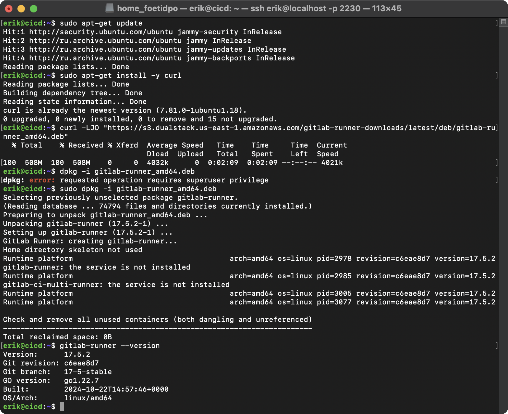 

    *** 
     

- **Task:** 
    - Run gitlab-runner and register it for use in the current project

- **Commands:**
    - `sudo gitlab-runner start`
    - `sudo gitlab-runner register`

- **Output:**     
    

    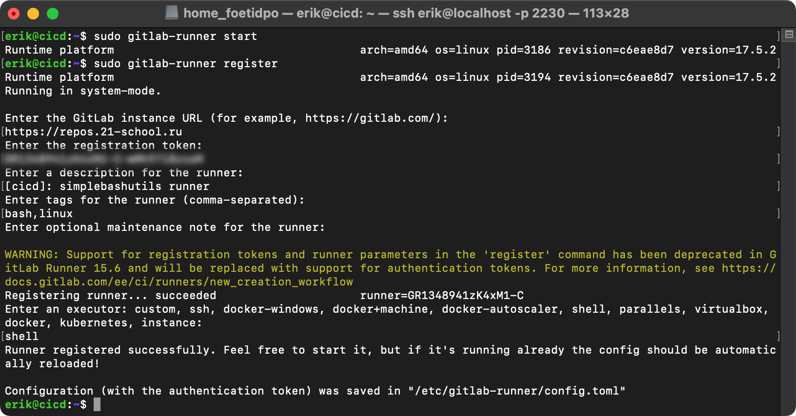 

## 2. Building

- **Task:** 
    - Write a stage for CI to build applications from the C2_SimpleBashUtils project
        - In the gitlab-ci.yml file, add a stage to start the building via makefile from the C2 project
        - Save post-build files (artifacts) to a random directory with a 30-day retention period

- **Command:**
    - `touch .gitlab-ci.yml`    

- **Output:**     
    

    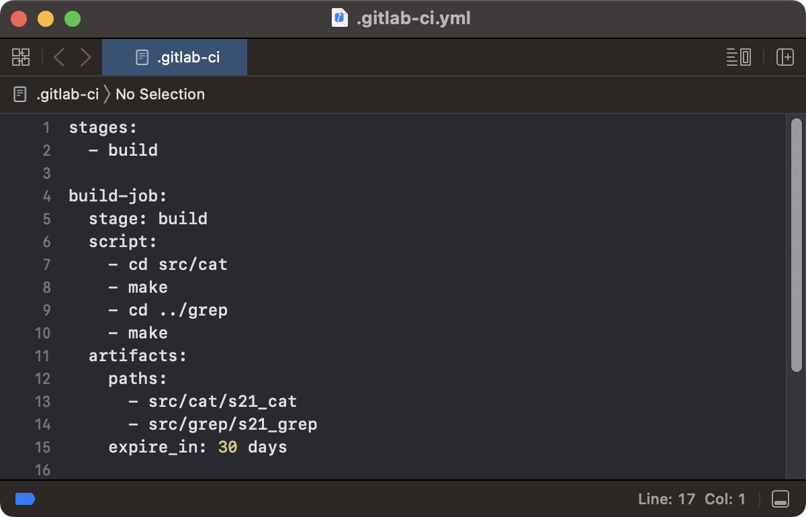 

## 3. Codestyle test

- **Task:** 
    - Write a stage for CI that runs a codestyle script (clang-format)
        - If the codefile didn't pass, fail the pipeline
        - In the pipeline, display the output of the clang-format utility

- **Output:**     
    

    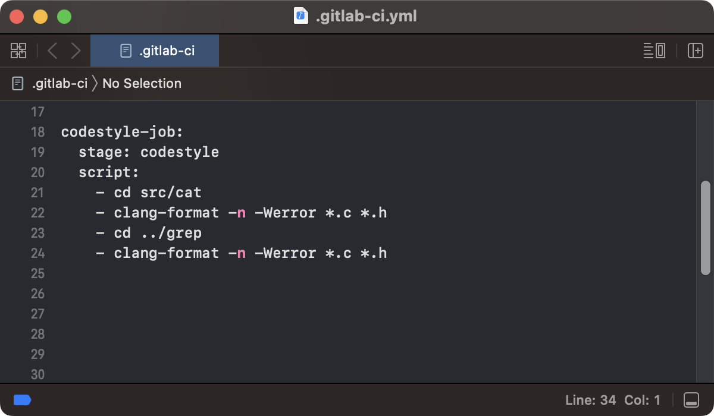 

## 4. Integration tests

- **Task:** 
    - Write a stage for CI that runs your integration tests from the same project
        - Run this stage automatically only if the build and codestyle test passes successfully
        - If tests didn't pass, fail the pipeline
        - In the pipeline, display the output of the succeeded / failed integration tests

- **Output:**     
    

    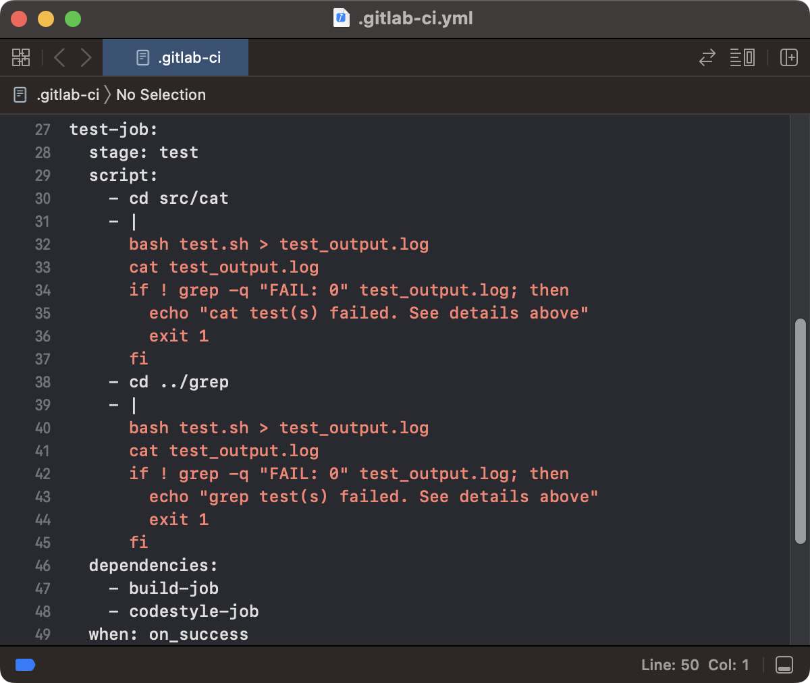 

## 5. Deployment stage

- **Task:** 
    - Write a stage for CD that "deploys" the project on another virtual machine
        - Run this stage manually, if all the previous stages have passed successfully
        - In case of an error, fail the pipeline

- **Output:**     
    

    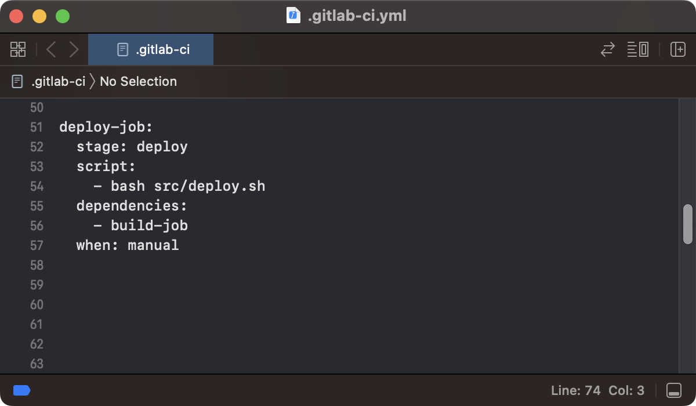 

    ***
     

- **Task:** 
    - Write a bash script which copies the files received after the building (artifacts) into the /usr/local/bin directory of the second virtual machine using ssh and scp

- **Output:**     
    

    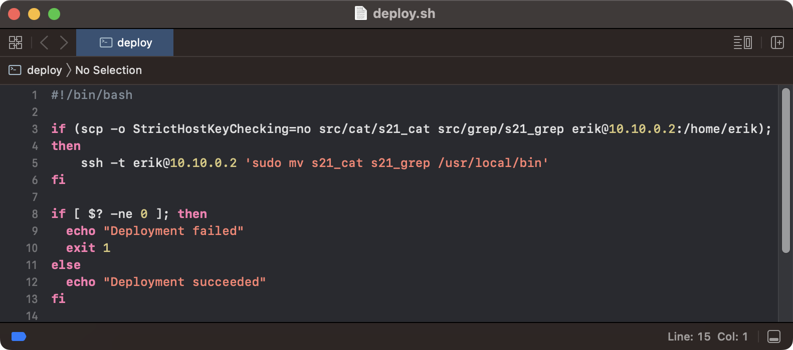 

- **Extra:**
    - To transfer files between two machines, it is needed to configure both machines' network adapters to an internal network and set a static IP address on each machine within the same subnet using following commands:
        - `sudo nano /etc/netplan/00-installer-config.yaml`
        - `sudo netplan apply`
    
    -  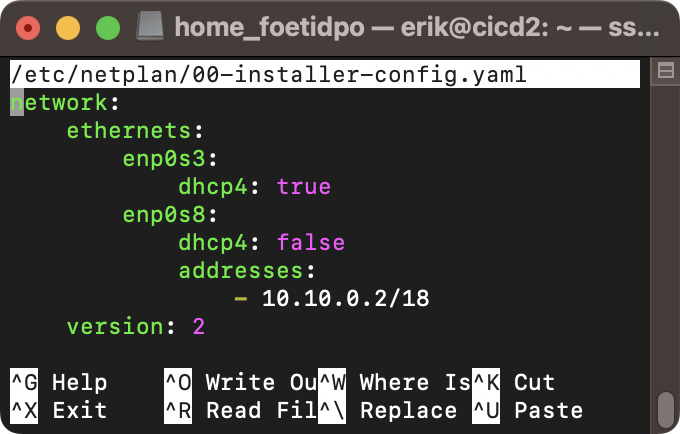 

     

    - Following commands is needed to configure SSH access for the GitLab Runner so it can connect to a remote machine without a password prompt, using the provided SSH key:
        - `ssh-keygen` - generates an SSH key on the machine running the GitLab Runner
        - `sudo su` - switches to the root user
        - `nano /etc/gitlab-runner/config.toml` - goes to the runner settings and specify where to find the SSH agent, need to add the line environment = ["SSH_AUTH_SOCK=/tmp/ssh-agent"] in the file
        - `ssh-keyscan -H 10.10.0.2 >> /home/gitlab-runner/.ssh/known_hosts` - adds the remote host with the IP 10.10.0.2 to the known_hosts file for the gitlab-runner user
        - `cp /home/erik/.ssh/id_rsa /home/gitlab-runner/.ssh/` - copies the private SSH key id_rsa from the user erik to the .ssh directory of the gitlab-runner user, this allows the runner to use the key for SSH connections to a remote server
        - `cd /home/gitlab-runner/.ssh/` - changes the directory to .ssh under the gitlab-runner user
        - `chown gitlab-runner:gitlab-runner id_rsa known_hosts` - changes the ownership of the id_rsa and known_hosts files to the gitlab-runner user and group, this ensures that only the gitlab-runner user has access to these files, maintaining security when using SSH

    - 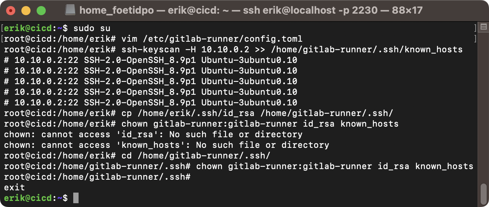    

     

    - To connect to the second machine without needing to enter a password, SSH key-based authentication must be configured. To do this, it is needed to copy the public key to the remote machine using following command: 
        - `ssh-copy-id erik@10.10.0.2`

    - 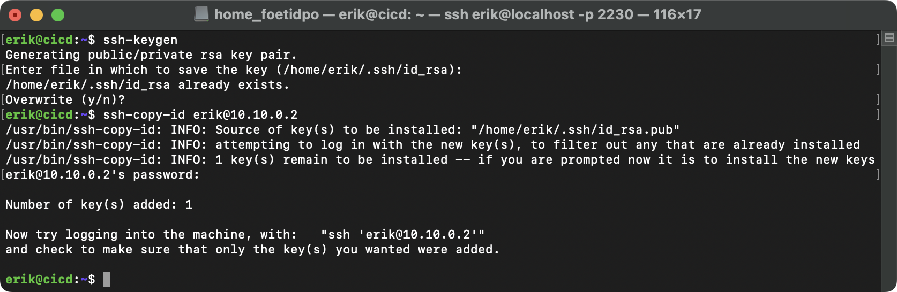 

     

    - Written script copies files into a directory without user permissions, so it is needed to allow user to execute mv command with superuser rights without requiring a password. To do this, add the specified line to the /etc/sudoers file on the second machine using following command:
        - `sudo visudo`

    - 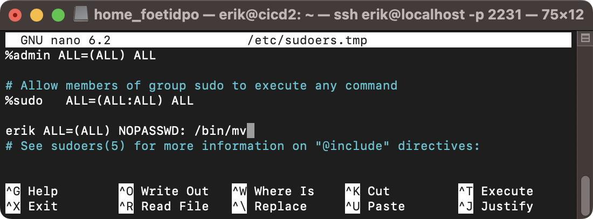 

## 6. Notifications

- **Task:** 
    - Set up notifications of successful/unsuccessful pipeline execution via bot named "[your nickname] DO6 CI/CD" in Telegram

- **Output:**     
    

    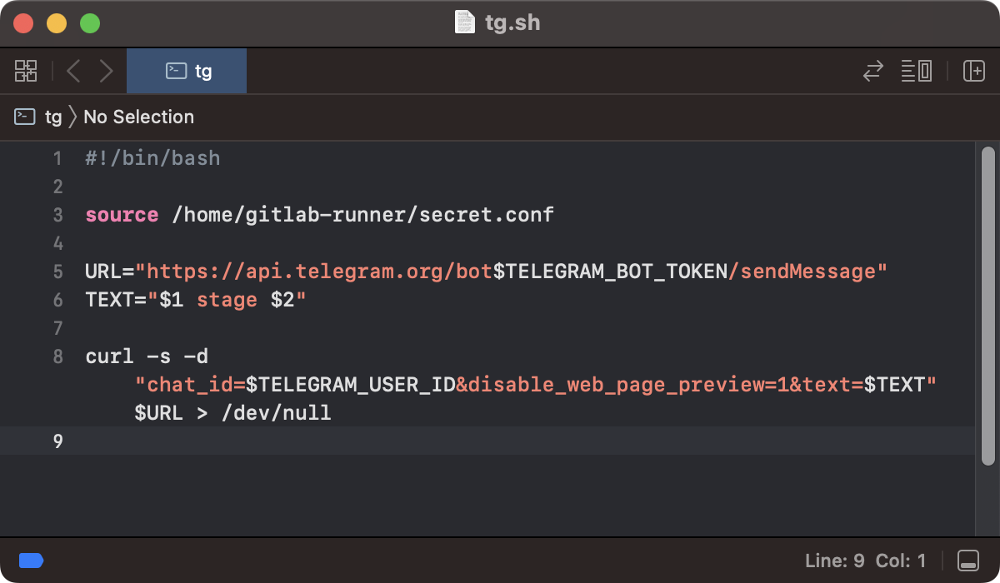 
    
    

    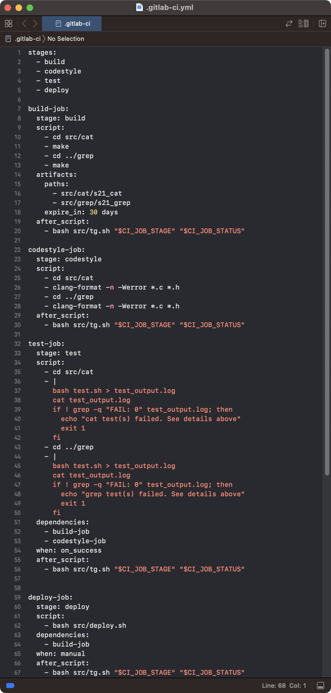 
     

## 7. Results    

- 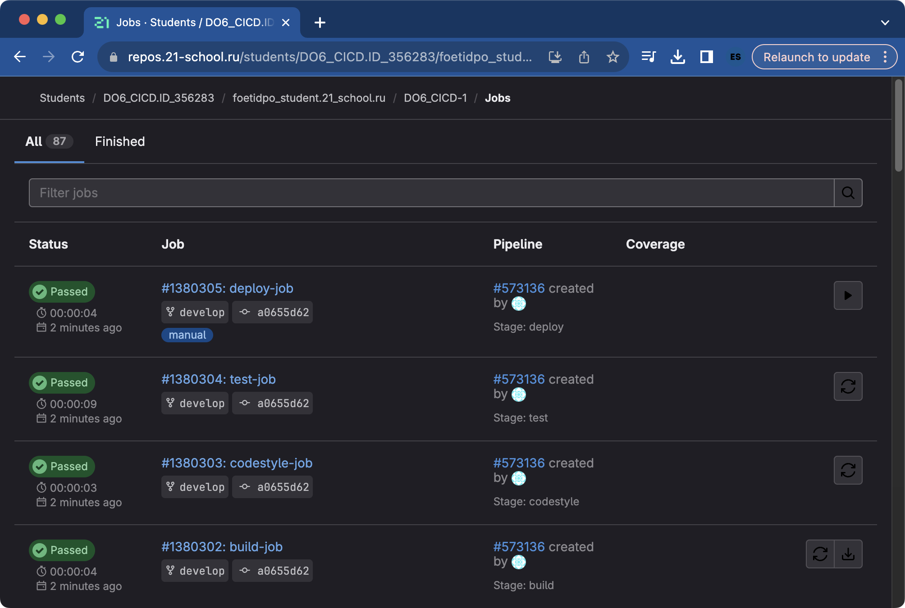 
- 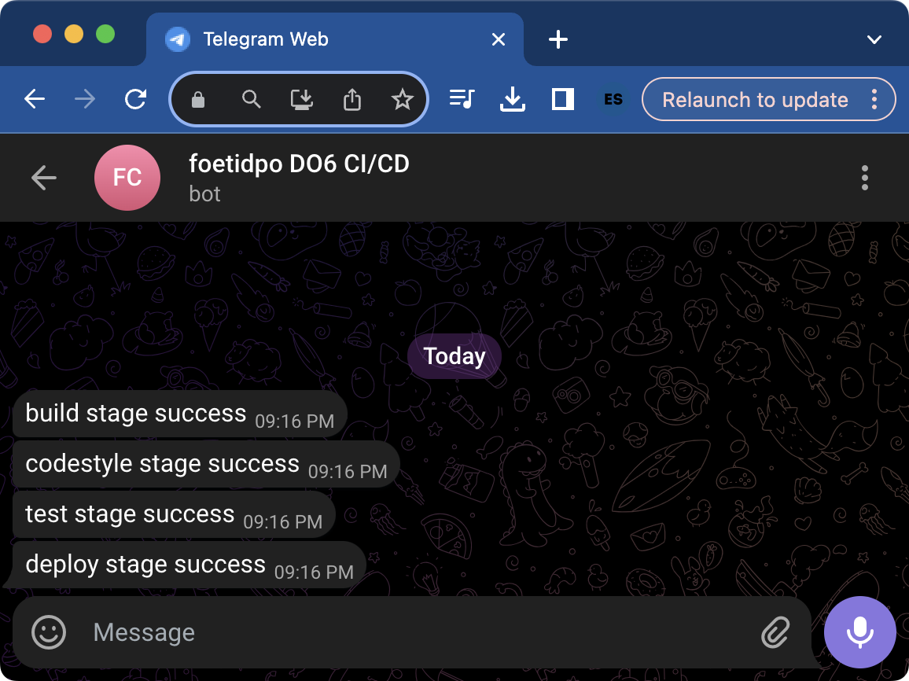 