# UNIX/Linux operating systems 

## Contents

1. [Installation of the OS](#1-installation-of-the-os)  
2. [Creating a user](#2-creating-a-user)  
3. [Setting up the OS network](#3-setting-up-the-os-network)   
4. [OS Update](#4-os-update)  
5. [Using the sudo command](#5-using-the-sudo-command)  
6. [Installing and configuring the time service](#6-installing-and-configuring-the-time-service)  
7. [Installing and using text editors](#7-installing-and-using-text-editors)  
8. [Installing and basic setup of SSHD service](#8-installing-and-basic-setup-of-the-sshd-service)  
9. [Installing and using the top, htop utilities](#9-installing-and-using-the-top-htop-utilities)   
10. [Using the fdisk utility](#10-using-the-fdisk-utility)   
11. [Using the df utility](#11-using-the-df-utility)    
12. [Using the du utility](#12-using-the-du-utility)    
13. [Installing and using the ncdu utility](#13-installing-and-using-the-ncdu-utility)    
14. [Working with system logs](#14-working-with-system-logs)     
15. [Using the CRON job scheduler](#15-using-the-cron-job-scheduler) 

 

## 1. Installation of the OS

- **Task:** 
    - Install Ubuntu 20.04 Server LTS without GUI
    - Check Ubuntu version

- **Command:** 
    - `cat /etc/issue` 

- **Output:**    
<ul style="list-style-type: none;"> <li> 

  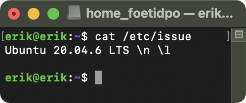

 </li> </ul>

## 2. Creating a user

- **Task:** 
    - Create a user other than the one created during installation
    - The user must be added to adm group

- **Commands:**
    - `sudo useradd -g adm foetidpo`
    - `cat /etc/passwd`
    - `groups foetidpo`

- **Output:**     
<ul style="list-style-type: none;"> <li>   

  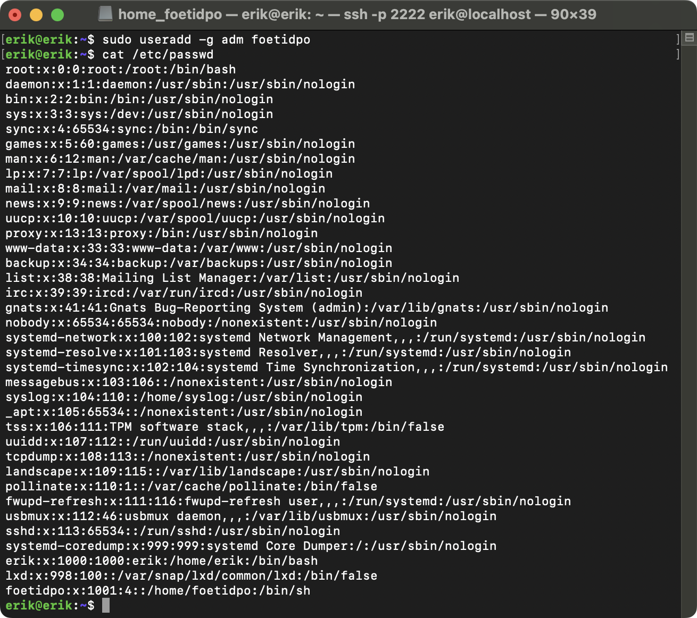

 </li> </ul>
<ul style="list-style-type: none;"> <li> 

  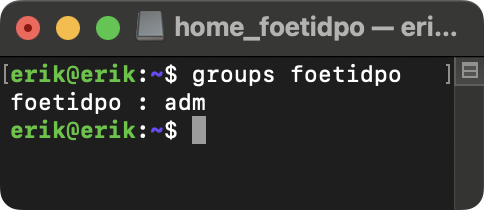

 </li> </ul>

## 3. Setting up the OS network

1. **Task:** 
    - Set the machine name as user-1 

   **Commands:**
    - `sudo hostnamectl set-hostname user-1`
    - `hostname`

   **Output:**     
    

    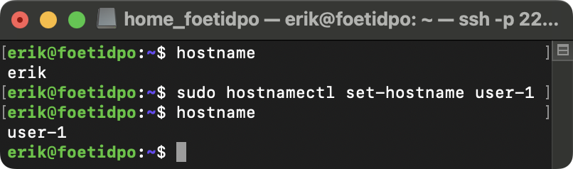
    
 

    *** 
     

2. **Task:** 
    - Set the time zone corresponding to your current location

    **Commands:**
    - `sudo timedatectl set-timezone Europe/Moscow`
    - `timedatectl`

    **Output:**     
    

    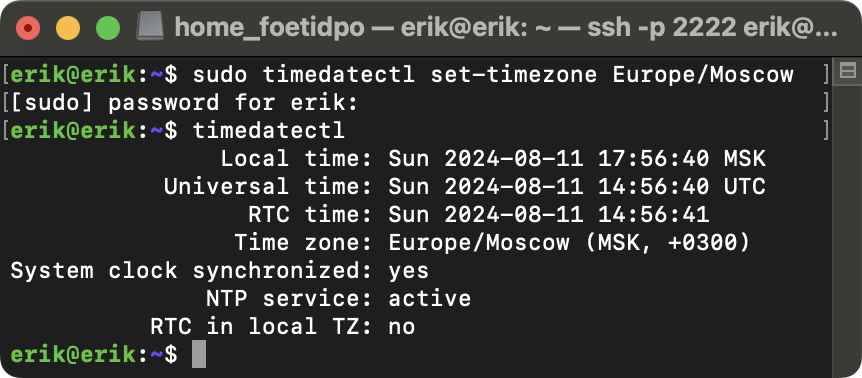
    
 

    *** 
     

3. **Task:** 
    - Output the names of the network interfaces using a console command

    **Command:**
    - `ifconfig -a`

    **Output:**     
    

    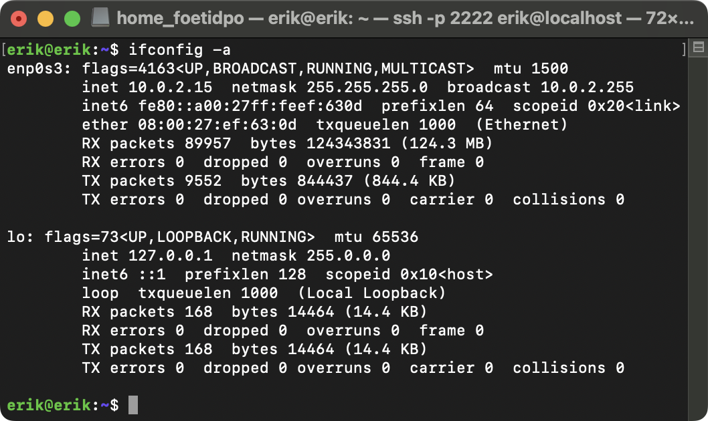
    
 

    **Extra:**   
    - The lo (loopback) interface is a virtual network interface used for internal communication within the same machine, typically associated with the IP address 127.0.0.1 (localhost). It allows applications to communicate internally without using physical network hardware. Essential for network services and applications, this interface is always present on systems using TCP/IP network stacks, such as Linux and other UNIX-like operating systems

    *** 
     

4. **Task:** 
    - Use the console command to get the ip address of the device you are working on from the DHCP server

    **Command:**
    - `hostname -I`

    **Output:**     
    

    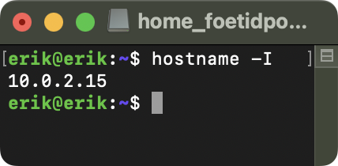
    
 

    **Extra:**   
    - DHCP (Dynamic Host Configuration Protocol) is a network management protocol used to automatically assign IP addresses and other network configuration details to devices on a network

    *** 
     

5. **Task:** 
    - Define and display the external ip address of the gateway (ip) and the internal IP address of the gateway, aka default ip address (gw)

    **Commands:**
    - External (internet-address): `curl ifconfig.co`
    - Internal (default): `ip route | grep default`

    **Output:**     
    

    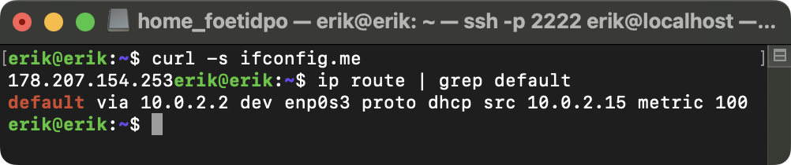
    
 

    *** 
     

6. **Task:** 
    - Set static (manually set, not received from DHCP server) ip, gw, dns settings (use public DNS servers, e.g. 1.1.1.1 or 8.8.8.8)

    **Commands:**
    - `sudo nano /etc/netplan/*.yaml`
    - `sudo netplan apply`

    **Output:**     
    

    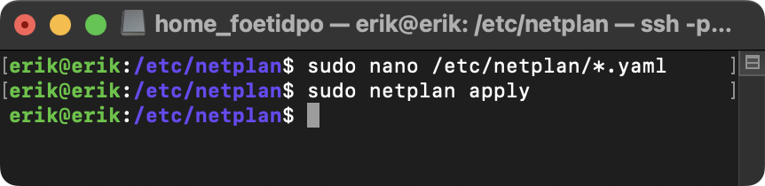
    
 
    

    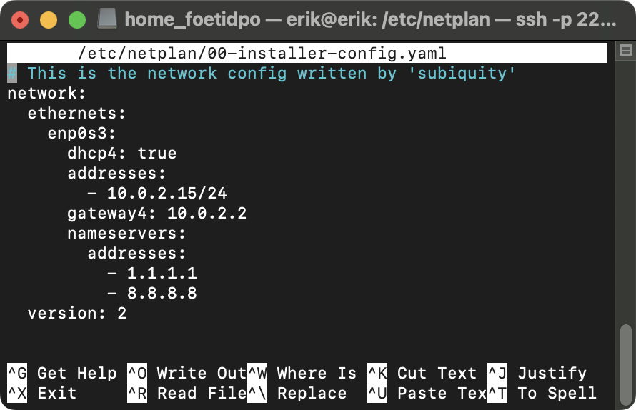
    
 

    *** 
     

7. **Task:** 
    - Reboot the virtual machine
    - Make sure that the static network settings (ip, gw, dns) correspond to those set in the previous point

    **Commands:**
    - `sudo reboot`
    - `ip addr show enp0s3`
    - `ip route | grep default`
    - `systemd-resolve --status | grep 'DNS Servers' -A 3`

    **Output:**     
    

    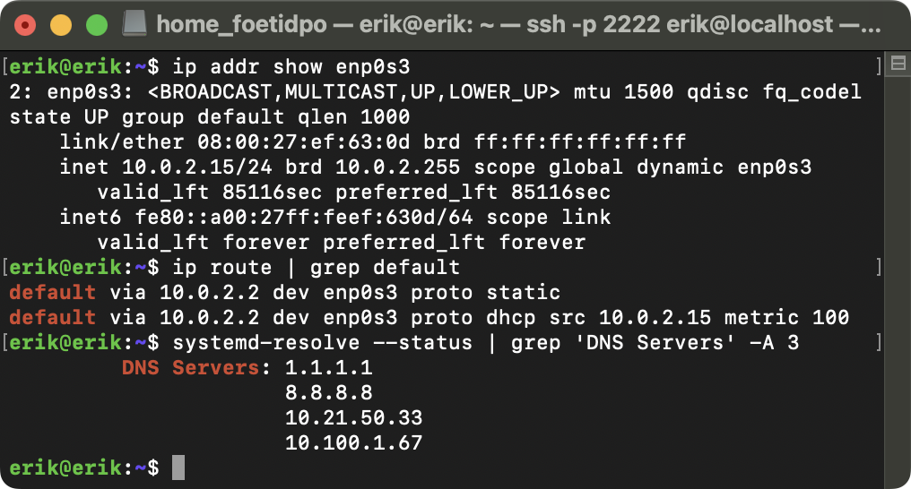
    
 

    *** 
         

8. **Task:** 
    - Ping 1.1.1.1 and ya.ru remote hosts
    - There should be "0% packet loss" phrase in command output

    **Commands:**
    - `ping -c 3 1.1.1.1`
    - `ping -c 3 ya.ru`

    **Output:**     
    

    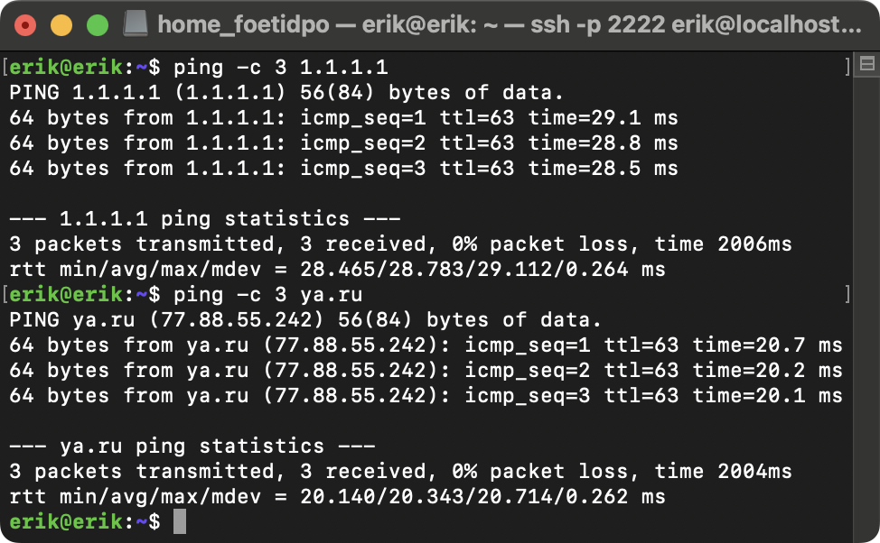
    
   

## 4. OS Update

- **Task:** 
    - Update the system packages to the latest version

- **Commands:** 
    - `sudo apt update` 
    - `sudo apt upgrade` 

- **Output:**     
<ul style="list-style-type: none;"> <li> 

  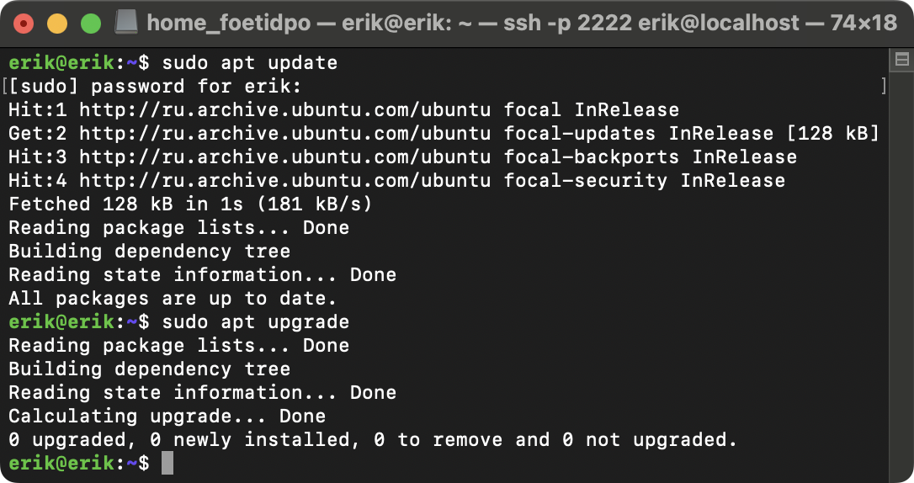

 </li> </ul>

## 5. Using the **sudo** command

- **Task:** 
    - Allow user created in [2](#2-creating-a-user) to execute sudo command
    - Change the OS hostname via the user created in [2](#2-creating-a-user) (using sudo)

- **Commands:** 
    - `sudo usermod -aG sudo foetidpo` 
    - `su foetidpo` 
    - `sudo hostnamectl set-hostname foetidpo` 

- **Output:**    
<ul style="list-style-type: none;"> <li>  

  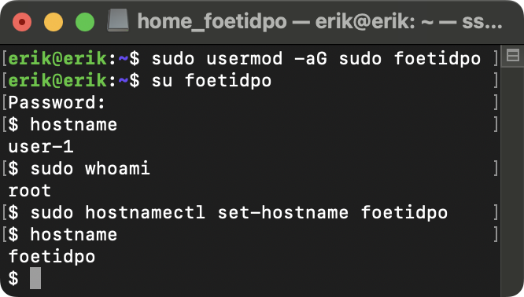

 </li> </ul> 

- **Extra:**   
    - The sudo command allows a permitted user to execute commands as the superuser or another user, with elevated privileges. It is used to perform administrative tasks safely and securely

## 6. Installing and configuring the time service

- **Task:** 
    - Set up the automatic time synchronisation service

- **Commands:** 
    - `sudo timedatectl set-timezone Europe/Moscow`
    - `TZ="Europe/Moscow" date` 
    - `timedatectl show` 

- **Output:**     
<ul style="list-style-type: none;"> <li> 

  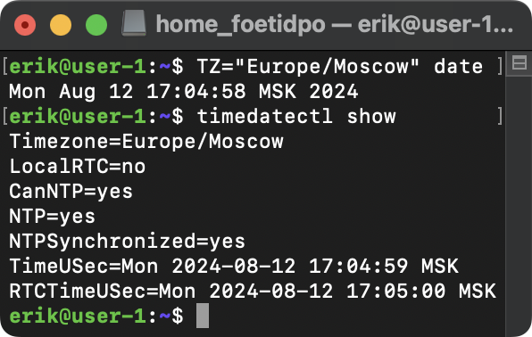

 </li> </ul>

## 7. Installing and using text editors

- **Task:** 
    - Install VIM text editor and any two others 
    - Create a *test_X.txt* file, write your nickname in it, close the file and save the changes
    - Edit the file by replacing the nickname with the "21 School 21" string, close the file without saving the changes
    - Edit the file again and then master the functions of searching through the contents of a file (a word) and replacing a word with any other one

    *** 
     

1. **VIM** 

   - Install: `sudo apt install vim`
   - Create and open: `vim test_vim.txt`
   - Close with saving: `Esc -> :wq -> Enter`

    

    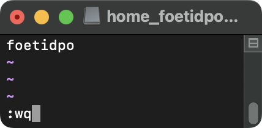
    
 

    - Close without saving: `Esc -> :q! -> Enter`

    

    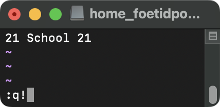
    
 

    - Search a word: `Esc -> /School -> Enter`

    

    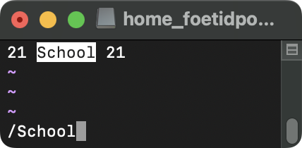
    
 

    - Replace a word: `Esc -> :%s/School/21 -> Enter`
    
    

    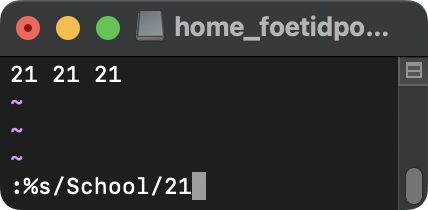
    
 

    *** 
     

2. **NANO** 

   - Install: `sudo apt install nano`
   - Create and open: `nano test_nano.txt`
   - Close with saving: `^X -> Y -> Enter`

    

    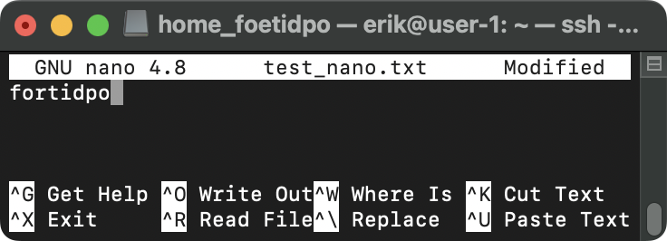
    
 

    - Close without saving: `^X -> N`

    

    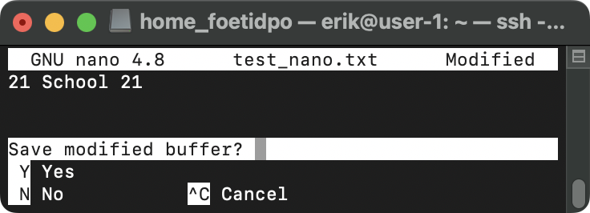
    
 

    - Search a word: `^W -> School -> Enter`

    

    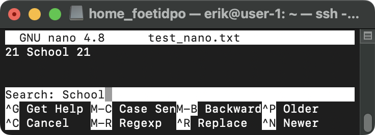
    
 

    - Replace a word: `^\ -> School -> Enter -> 21 -> Enter -> Y`
    
    

    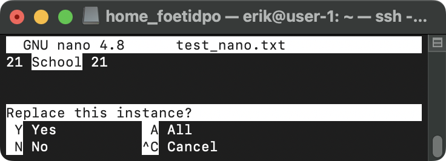
    
 

    *** 
         

3. **EMACS** 

   - Install: `sudo apt install emacs`
   - Create and open: `emacs test_emacs.txt`
   - Close with saving: `^X -> ^S -> ^X -> ^C`

    

    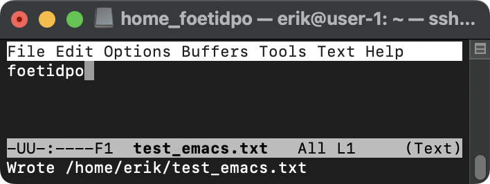
    
 

    - Close without saving: `^X -> ^C -> N`

    

    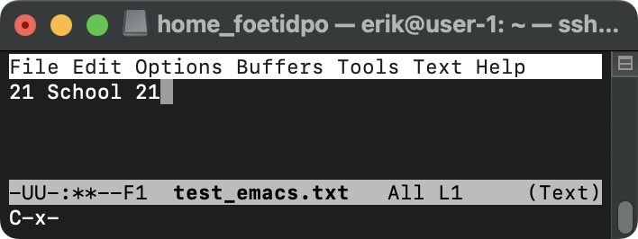
    
 

    - Search a word: `^S -> School -> Enter`

    

    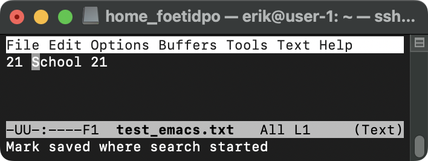
    
 

    - Replace a word: `Esc + X -> replace-string -> School -> Enter -> 21 -> Enter`
    
    

    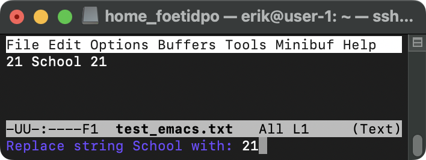
    
 

## 8. Installing and basic setup of the SSHD service

1. **Task:** 
    - Install the SSHd service

   **Commands:**
    - `sudo apt install openssh-server`
    - `sudo systemctl start ssh`

   **Output:**     
    

    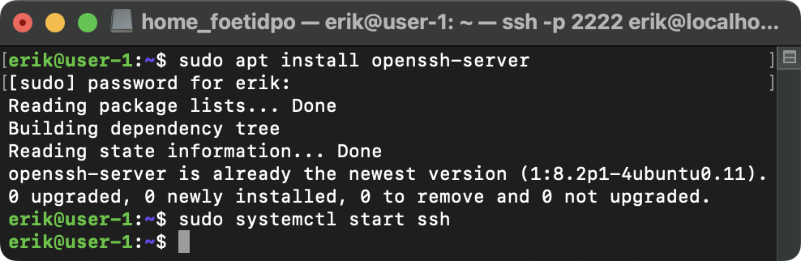
    
 

    *** 
     

2. **Task:** 
    - Add an auto-start of the service whenever the system boots

   **Command:**
    - `sudo systemctl enable ssh`

   **Output:**     
    

    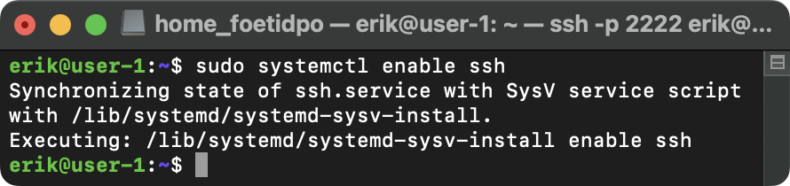
    
 

    *** 
         

3. **Task:** 
    - Reset the SSHd service to port 2022

   **Commands:**
    - `sudo nano /etc/ssh/sshd_config`
    - `sudo systemctl restart ssh`

   **Output:**     
    

    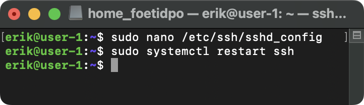
    
 
    

    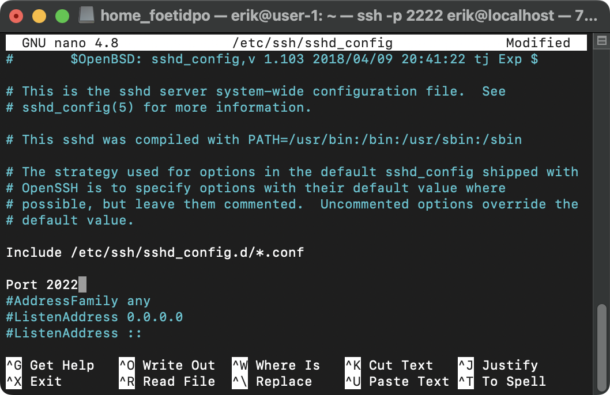
    
 

    *** 
          

4. **Task:** 
    - Show the presence of the sshd process using the ps command
    - Need to match the keys to the command

    **Command:**
    - `ps aux | grep sshd`

    **Output:**     
    

    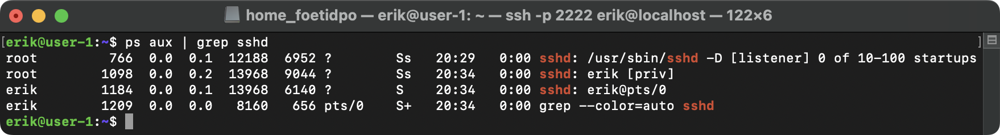
    
 

    **Extra:**   
    - ps (process status) - command that displays information about active processes on the system
    - a - shows processes running by all users, not just the current user
    - u - displays processes in a user-oriented format, including the username
    - x - includes processes that are not connected to a terminal, such as background processes
    - | - pipes the output of the previous command into the grep command
    - grep sshd - filters the output to show only lines containing sshd

    *** 
           

5. **Task:** 
    - Reboot the system
    - Run netstat -tan command

    **Commands:**
    - `sudo reboot`
    - `netstat -tan`

    **Output:**     
    

    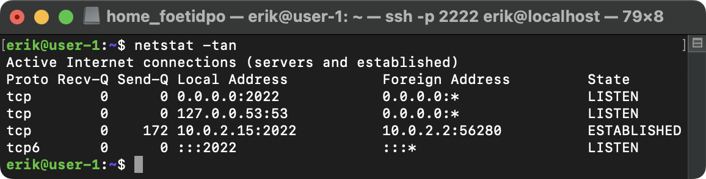
    
 

    **Extra:**   
    - netstat - command that provides information about network connections, routing tables, interface statistics etc.
    - t - shows TCP connections
    - a - shows all connections and listening ports
    - n - displays numerical addresses and port numbers
    - Proto (Protocol) - indicates the protocol used 
    - Recv-Q (Receive Queue) - shows the amount of data (in bytes) that is queued and waiting to be received by the application
    - Send-Q (Send Queue) - shows the amount of data (in bytes) that is queued and waiting to be sent by the application
    - Local Address - displays the IP address and port number of the local end of the connection
    - Foreign Address - shows the IP address and port number of the remote end of the connection 
    - State - indicates the state of the TCP connection (ESTABLISHED - the connection is established and data can be sent, LISTEN - the socket is listening for incoming connections)
    - 0.0.0.0 - represents "all available interfaces" 

## 9. Installing and using the top, htop utilities

1.  **Task:** 
    - Run the top utility

    **Command:**
    - `top`

    **Output:**     
    

    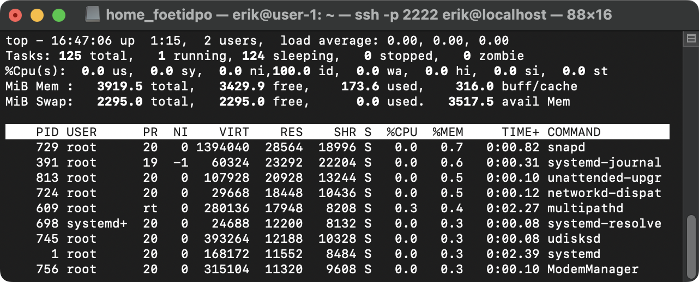
    
 

    **Extra:**   
    - Uptime - 1:15
    - Number of authorised users - 2
    - Total system load - 0.00, 0.00, 0.00 (1, 5, 15 min)
    - Total number of processes - 125
    - Cpu load - 0.0 us,  0.0 sy,  0.0 ni, 100.0 id,  0.0 wa,  0.0 hi,  0.0 si,  0.0 st (user, system, nice, idle, wait I/O, hardware interrupts, software interrupts, steal)
    - Memory load - 3919.5 total, 3429.9 free, 173.6 used, 316.0 buff/cache
    - Pid of the process with the highest memory usage - 729 (Shift + M)
    - Pid of the process taking the most CPU time - 1516 (Shift + P)

    *** 
     

2.  **Task:** 
    - Install and run the htop utility

    **Commands:**
    - `sudo apt install htop`
    - `htop`

    **Output:**     
    - Sorted by PID (F6 -> PID -> Enter):
    

    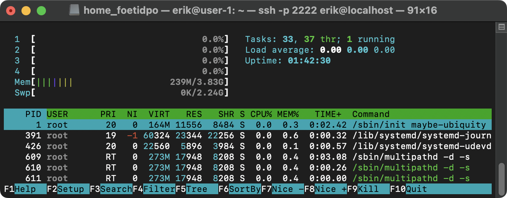
    
 

    - Sorted by PERCENT_CPU (Shift + P):
    

    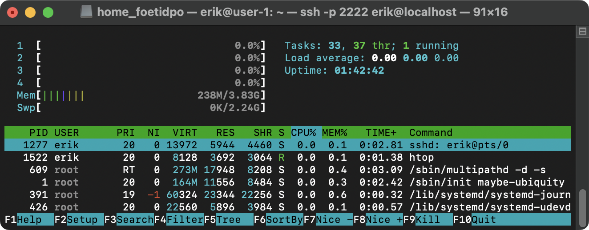
    
 

    - Sorted by PERCENT_MEM (Shift + M):
    

    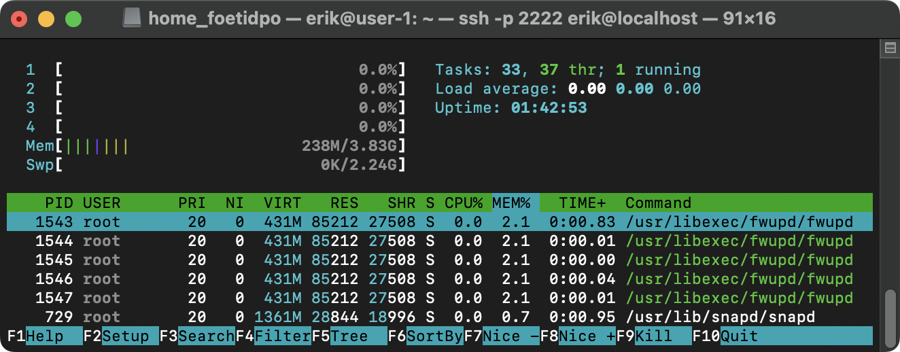
    
 

    - Sorted by TIME (Shift + T):
    

    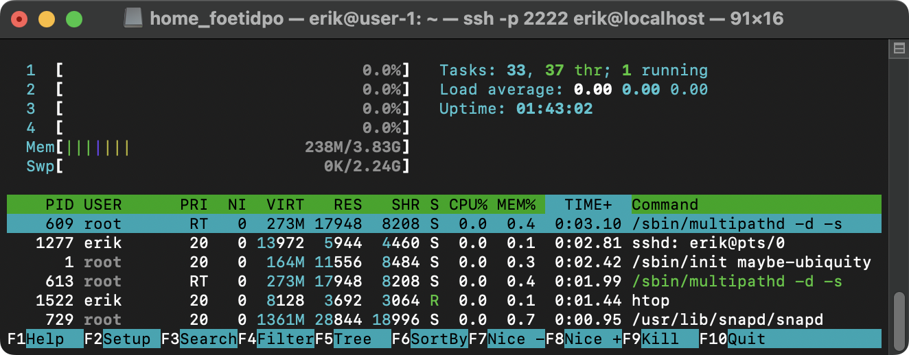
    
 

    - Filtered for sshd process (F4 -> sshd -> Enter):
    

    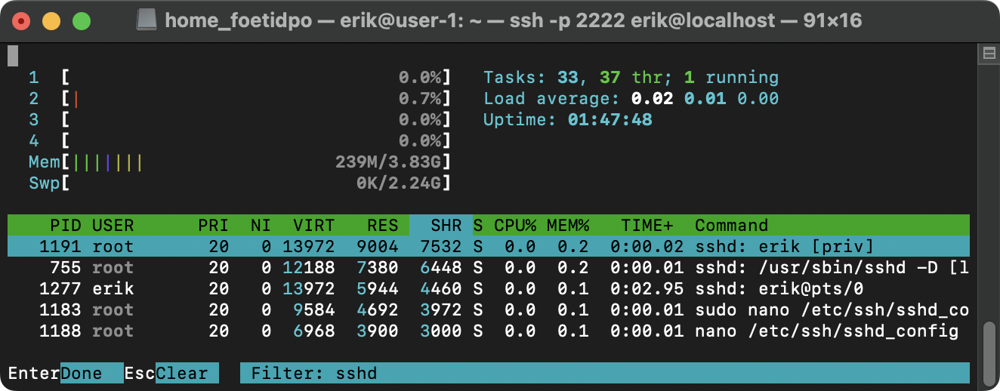
    
 

    - With the syslog process found by searching (F3 -> syslog -> Enter):
    

    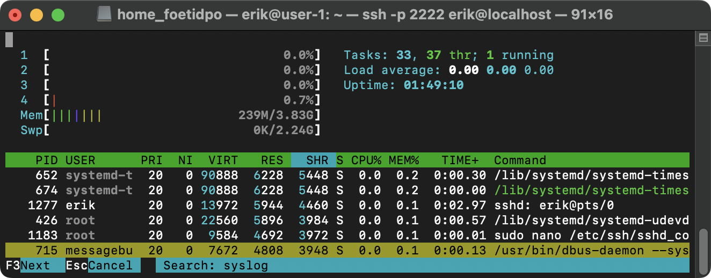
    
 

    - With hostname, clock and uptime output added (F2 -> Meters -> Enter -> ... -> F10):
    

    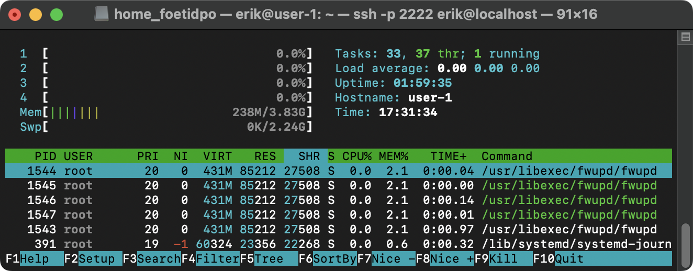
    
 

## 10. Using the fdisk utility

- **Task:** 
    - Run the fdisk -l command

- **Command:** 
    - `sudo fdisk -l` 

- **Output:**    
<ul style="list-style-type: none;"> <li> 

  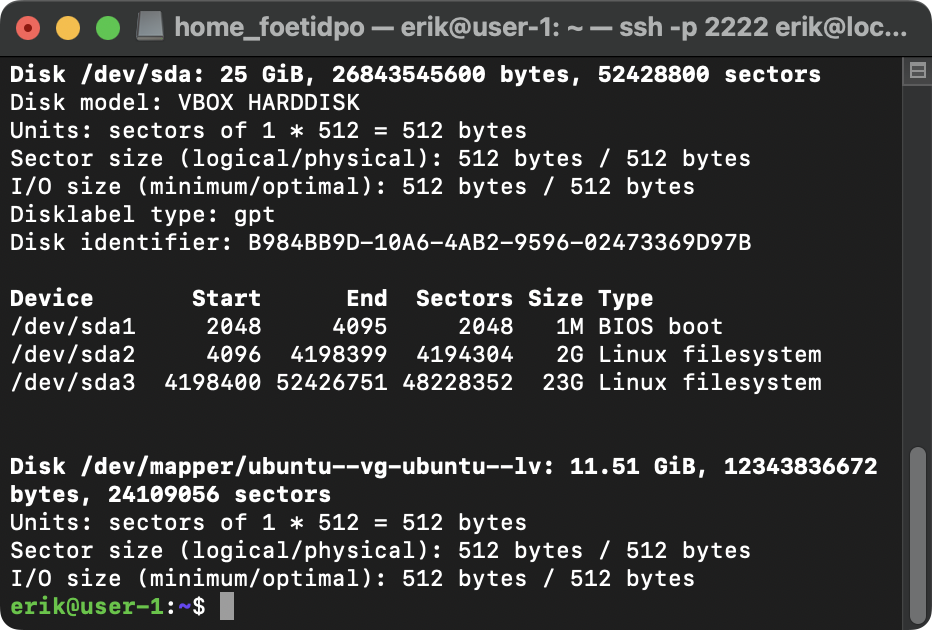

 </li> </ul>

- **Extra:**   
    - Name of the hard disk - /dev/sda
    - Capacity - 25 GiB
    - Number of sectors - 52428800 
    - Swap size - 2.2G (swapon --show)

## 11. Using the df utility

1.  **Task:** 
    - Run the df command

    **Command:**
    - `df /`

    **Output:**     
    

    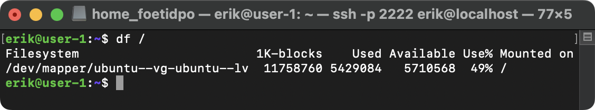
    
 

    **Extra:**   

    For the root partition (/):

    - Partition size - 11758760
    - Space used - 5429084
    - Space free - 5710568
    - Percentage used - 49%

    The measurement unit is kibibytes

    *** 
     

2.  **Task:** 
    - Run the df -Th command

    **Command:**
    - `df -Th /`

    **Output:**     
    

    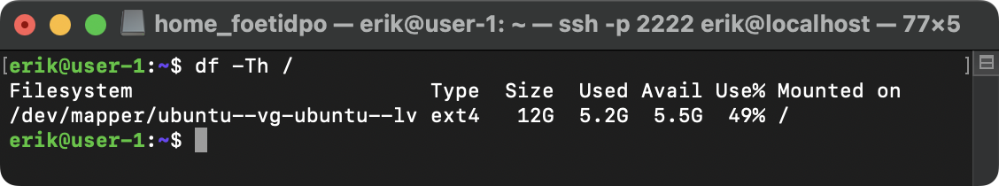
    
 

    **Extra:**   

    For the root partition (/):

    - Partition size - 12G
    - Space used - 5.2G
    - Space free - 5.5G
    - Percentage used - 49%

    The file system type is ext4
    

## 12. Using the du utility

1.  **Task:** 
    - Run the du command

    **Command:**
    - `du`

    **Output:**     
    

    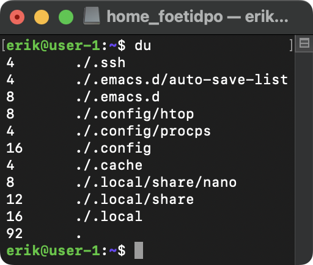
    
 

    *** 
     

2.  **Task:** 
    - Output the size of the /home, /var, /var/log folders (in bytes, in human readable format)

    **Command:**
    - `sudo du -sbh /var/log /var /home`

    **Output:**     
    

    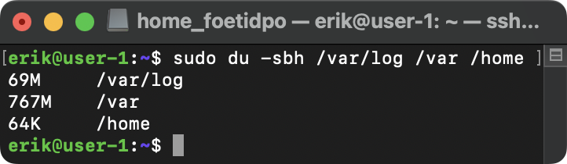
    
 

    *** 
         

3.  **Task:** 
    - Output the size of all contents in /var/log (not the total, but each nested element using *)

    **Command:**
    - `sudo du -abh /var/log/*`

    **Output:**     
    

    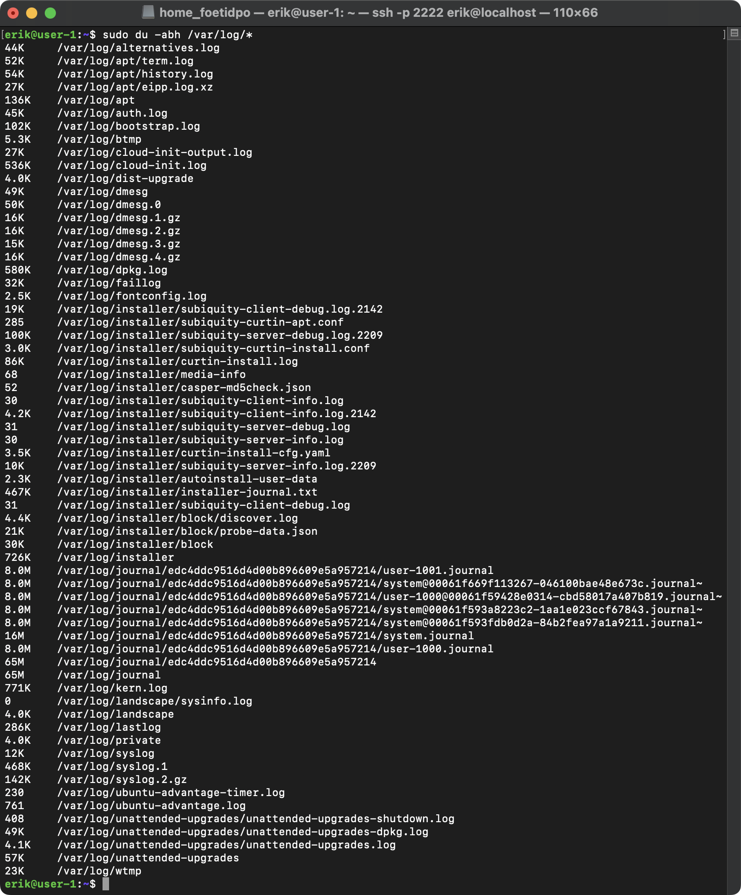
    
   

## 13. Installing and using the **ncdu** utility

- **Task:** 
    - Install the ncdu utility
    - Output the size of the /home, /var, /var/log folders
    - The size should be approximately the same as in [12](#12-using-the-du-utility)

- **Commands:** 
    - `sudo apt install ncdu` 
    - `ncdu /home` 
    - `ncdu /var` 
    - `ncdu /var/log` 

- **Output:**    
<ul style="list-style-type: none;"> <li> 

  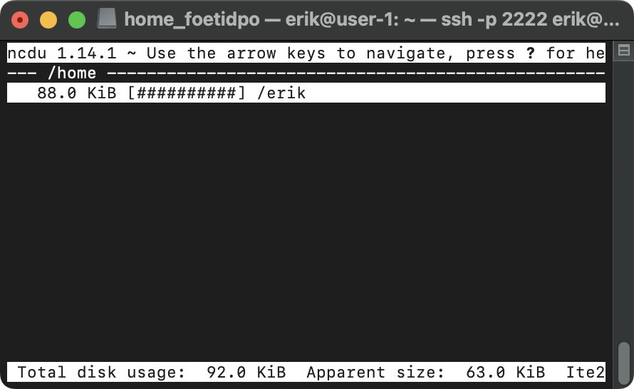

 </li> </ul>
<ul style="list-style-type: none;"> <li> 

  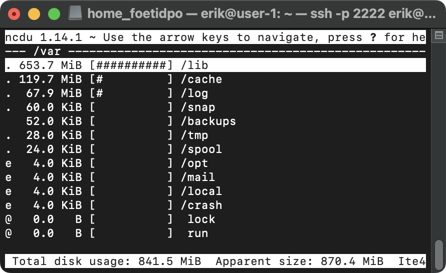

 </li> </ul>
<ul style="list-style-type: none;"> <li> 

  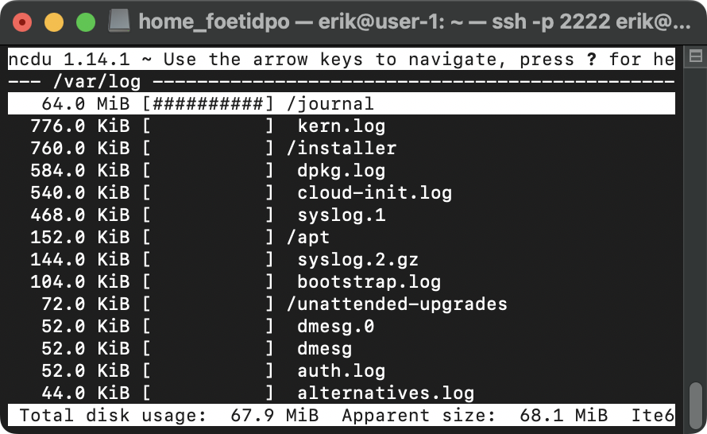

 </li> </ul>

## 14. Working with system logs

1.  **Task:** 
    - Write the last successful login time, user name and login method using logs

    **Command:**
    - `vim /var/log/auth.log`

    **Output:**     
    

    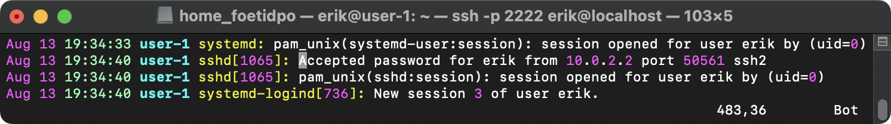
    
 

    **Extra:**   
    - Login time - Aug 13 19:34:40
    - User name - erik
    - Login method - password

    *** 
     

2.  **Task:** 
    - Restart SSHd service
    - Find service restart message in the logs

    **Commands:**
    - `sudo systemctl restart sshd`
    - `vim /var/log/syslog`

    **Output:**     
    

    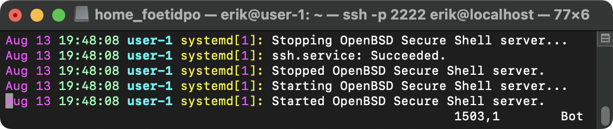
    
 

## 15. Using the CRON job scheduler

1.  **Task:** 
    - Using the job scheduler, run the uptime command in every 2 minutes
    - Display a list of current jobs for CRON

    **Commands:**
    - `crontab -e`
    - `crontab -l`

    **Output:**     
    

    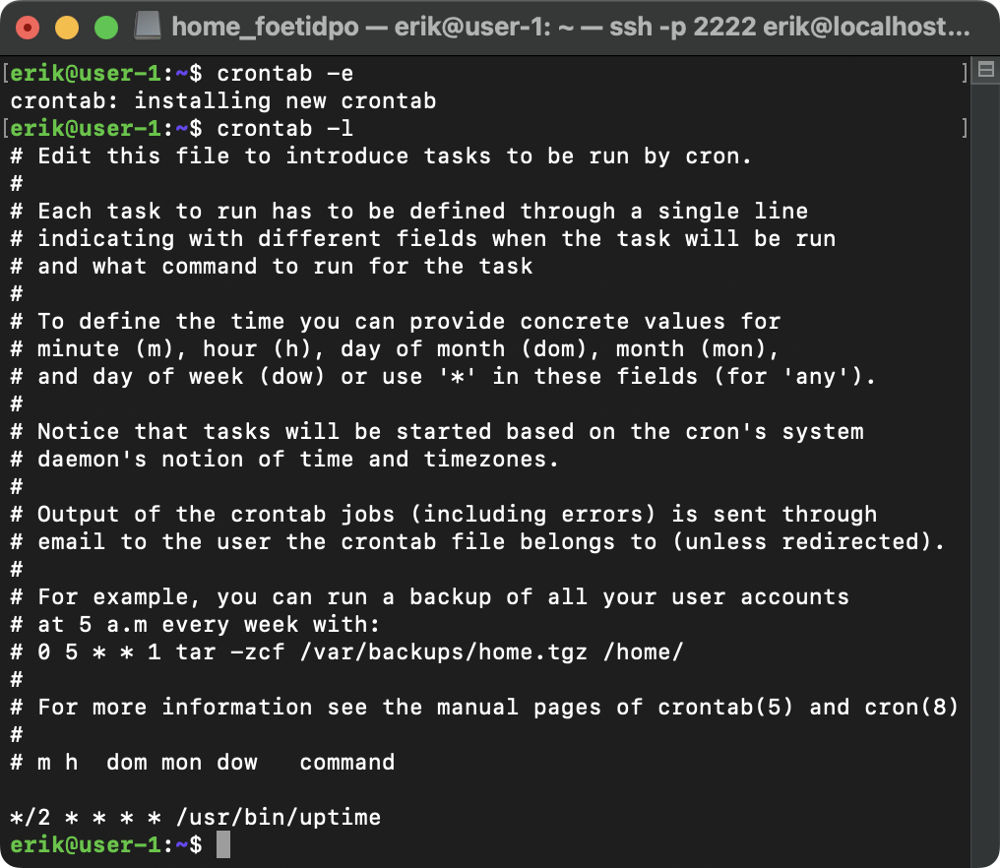
    
 

    *** 
     

2.  **Task:** 
    - Find lines in the system logs (at least two within a given time range) about the execution

    **Command:**
    - `vim /var/log/syslog`

    **Output:**     
    

    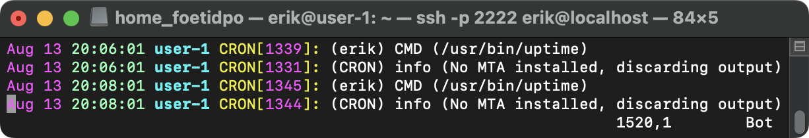
    
 

    *** 
     

2.  **Task:** 
    - Remove all tasks from the job scheduler

    **Command:**
    - `crontab -e`
    - `crontab -l`

    **Output:**     
    

    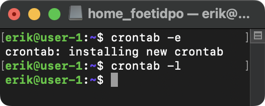
    
     