# Linux Network

## Contents

1. [ipcalc tool](#1-ipcalc-tool)  
    1.1. [Networks and masks](#11-networks-and-masks)  
    1.2. [localhost](#12-localhost)  
    1.3. [Network ranges and segments](#13-network-ranges-and-segments)
2. [Static routing between two machines](#2-static-routing-between-two-machines)  
    2.1. [Adding a static route manually](#21-adding-a-static-route-manually)  
    2.2. [Adding a static route with saving](#22-adding-a-static-route-with-saving)  
3. [iperf3 utility](#3-iperf3-utility)  
    3.1. [Connection speed](#31-connection-speed)  
    3.2 [iperf3 utility](#32-iperf3-utility)  
4. [Network firewall](#4-network-firewall)  
    4.1 [iptables utility](#41-iptables-utility)  
    4.2 [nmap utility](#42-nmap-utility)  
5. [Static network routing](#5-static-network-routing)  
    5.1. [Configuration of machine addresses](#51-configuration-of-machine-addresses)  
    5.2. [Enabling IP forwarding](#52-enabling-ip-forwarding)  
    5.3. [Default route configuration](#53-default-route-configuration)  
    5.4. [Adding static routes](#54-adding-static-routes)  
    5.5. [Making a router list](#55-making-a-router-list)  
    5.6. [Using ICMP protocol in routing](#56-using-icmp-protocol-in-routing)  
6. [Dynamic IP configuration using DHCP](#6-dynamic-ip-configuration-using-dhcp)  
7. [NAT](#7-nat)  
8. [SSH Tunnels](#8-ssh-tunnels)  

 

## 1. ipcalc tool

ipcalc is a utility that can perform simple manipulations of IPv4 addresses

### 1.1. **Networks and masks**  

1. **Task:** 
    - Define network address of 192.167.38.54/13

    **Command:**
    - `ipcalc 192.167.38.54/13 | grep Network`

    **Output:**     
    - Network address of 192.167.38.54/13 is 192.160.0.0
    

    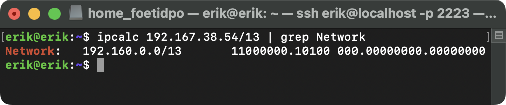
    
 

    **Extra:**
    - *Network* is the unique identifier for a specific subnet

    *** 
     

2. **Task:** 
    - Define conversion of the listed masks 

    **Commands (templates):**
    - `ipcalc 0.0.0.0/255.255.255.0 | grep Netmask`
    - `ipcalc 0.0.0.0/15 | grep Netmask`

    **Output:**     
    - 255.255.255.0 to prefix is 24  
    - 255.255.255.0 to binary is 11111111.11111111.11111111.00000000 
    

    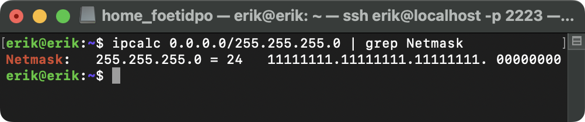
    
 

    - /15 to normal is 255.254.0.0
    - /15 to binary is 11111111.11111110.00000000.00000000 
    

    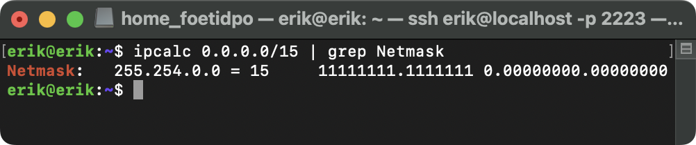
    
 

    - 11111111.11111111.11111111.11110000 to normal is 255.255.255.240
    - 11111111.11111111.11111111.11110000 to prefix is /28 
    

    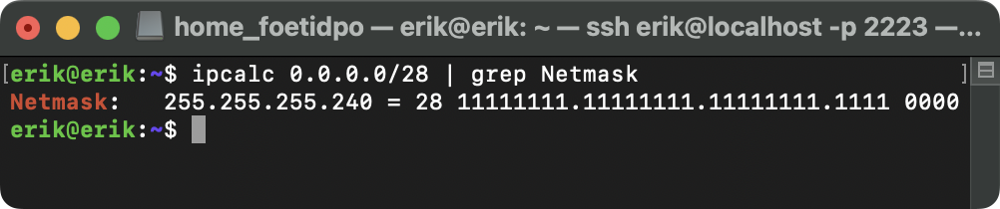
    
 

    **Extra:**
    - *Address* is a unique identifier for a device on a network
    - *Netmask* is a tool that helps divide an IP address into network and host parts

    *** 
     

2. **Task:** 
    - Define minimum and maximum host in 12.167.38.4 network with listed masks 

    **Commands (templates):**
    - `ipcalc 12.167.38.4/8 | grep -e HostMin -e HostMax`
    - `ipcalc 12.167.38.4/255.255.254.0 | grep -e HostMin -e HostMax`

    **Output:** 
    - Minimum host with /8 is 12.0.0.1
    - Maximum host with /8 is 12.255.255.254
    

    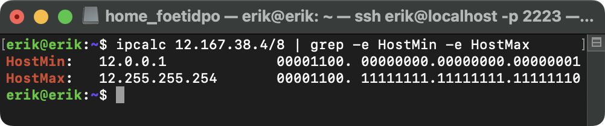
    
 

    - Minimum host with /11111111.11111111.00000000.00000000 is 12.167.0.1
    - Maximum host with /11111111.11111111.00000000.00000000 is 12.167.255.254
    

    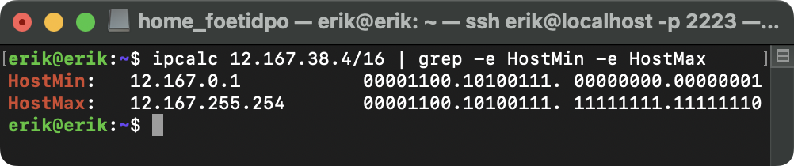
    
 

    - Minimum host with /255.255.254.0 is 12.167.38.1
    - Maximum host with /255.255.254.0 is 12.167.39.254
    

    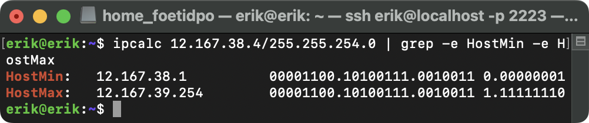
    
 

    - Minimum host with /4 is 0.0.0.1
    - Maximum host with /4 is 15.255.255.254
    

    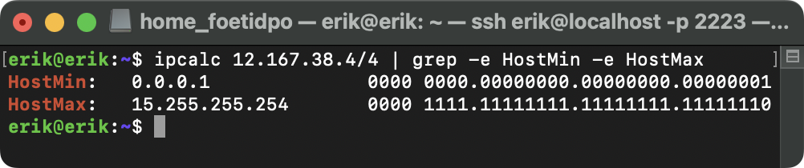
    
 

     **Extra:**
    - *HostMin* is the first usable IP address in the subnet, which is typically the IP address immediately following the network address

    - *HostMax* is the last usable IP address in the subnet, which is typically the IP address immediately preceding the broadcast address

*** 

### 1.2. **localhost**  

- **Task:** 
    - Define whether an application running on localhost can be accessed with the listed IPs

- **Command (template):**
    - `ipcalc 194.34.23.100 | grep Loopback`

- **Output:**     
    - Can be accessed: 127.0.0.2, 127.1.0.1
    - Can't be accessed: 194.34.23.100, 128.0.0.1
    

    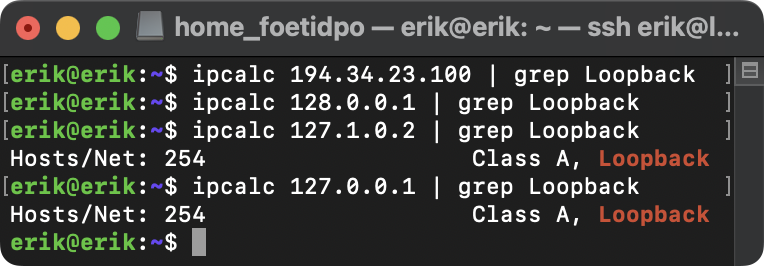
    
 

- **Extra:**
    - *Localhost* is a hostname that refers to the current device and is used to access network services running on that device via its loopback interface

***   

### 1.3. **Network ranges and segments**  

1. **Task:** 
    - Define which of the listed IPs can be used as public and which only as private

    **Command (template):**
    - `ipcalc 10.0.0.45 | grep Private`

    **Output:**     
    - Public: 134.43.0.2, 172.0.2.1, 192.172.0.1, 172.68.0.2, 192.169.168.1
    - Private: 10.0.0.45, 192.168.4.2, 172.20.250.4, 172.16.255.255, 10.10.10.10
    

    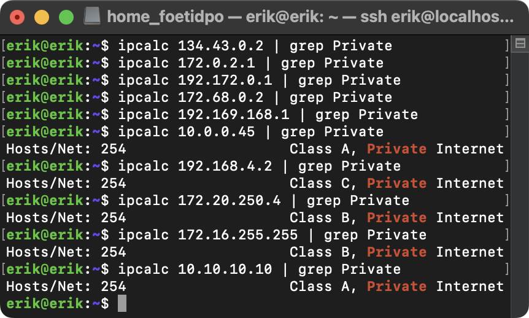
    
 

    **Extra:**
    - *Public IP* is a unique identifier assigned to a device on the internet. It is globally routable and can be accessed from anywhere on the internet

    - *Private IP* is an identifier assigned to a device within a private network. It is not globally routable and is used for internal communication within the same network

    *** 
     

2. **Task:** 
    - Define which of the listed gateway IP addresses are possible for 10.10.0.0/18 network

    **Command:**
    - `ipcalc 10.10.0.0/18 | grep -e HostMin -e HostMax`

    **Output:**     
    - Possible: 10.10.0.2, 10.10.10.10, 10.10.1.255
    - Not possible: 10.0.0.1, 10.10.100.1
    

    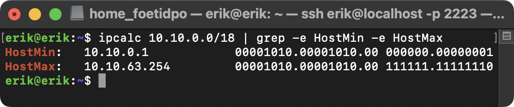
    
 

## 2. Static routing between two machines

- **Task:** 
    - Start two virtual machines (ws1 and ws2)
    - View existing network interfaces with the ip a command

- **Command:**
    - `ip a`

- **Output:**     
    

    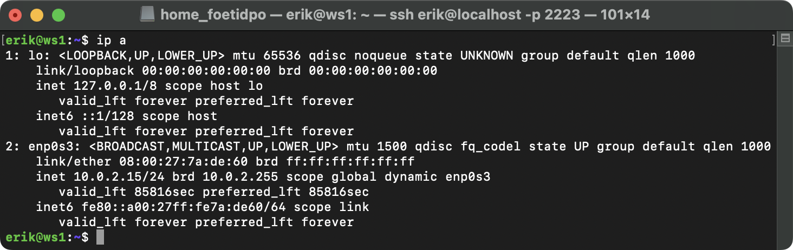
    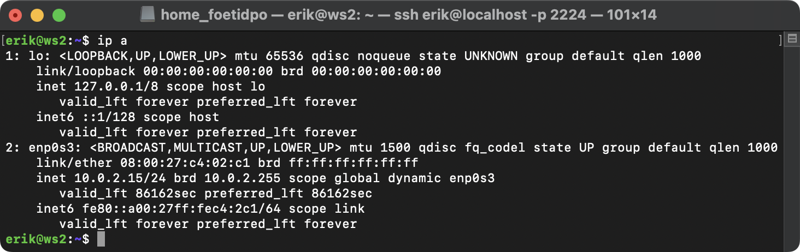
    
 

    ***
     

- **Task:** 
    - Describe the network interface corresponding to the internal network on both machines and set the following addresses and masks: ws1 — 192.168.100.10, mask /16, ws2 — 172.24.116.8, mask /12

- **Command:**
    - `sudo nano /etc/netplan/00-installer-config.yaml`

- **Output:**     
    

    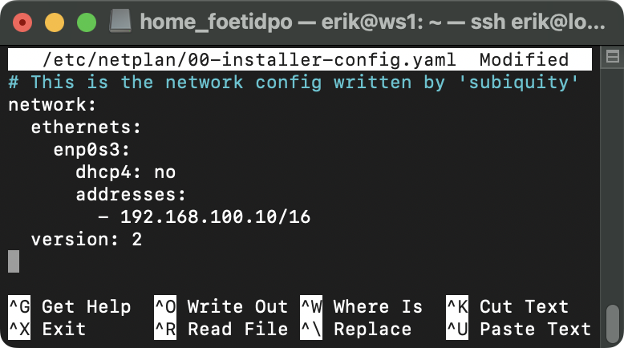
    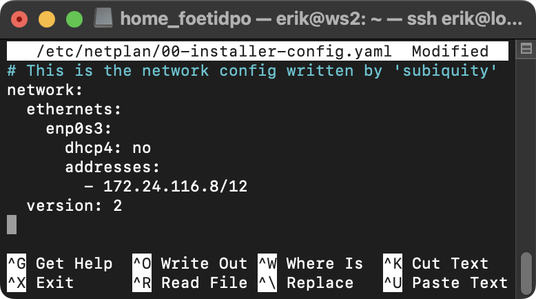 
 

- **Extra:**
    - To connect two virtual machines to each other, it is needed to use the Internal Network interface type. When only one adapter is enabled and configured with the Internal Network, there is no access to the internet and no ability to forward ports. To resolve this, it is needed to enable another adapter with NAT and configure /etc/netplan/00-installer-config.yaml file

    ***
     

- **Task:** 
    - Run the netplan apply command to restart the network service

- **Command:**
    - `sudo netplan apply`

- **Output:**     
    

    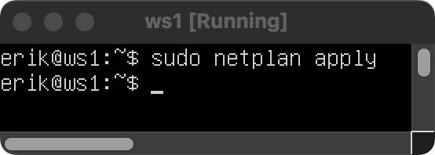
    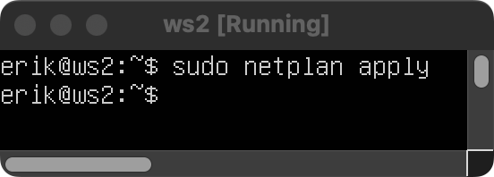 

    

    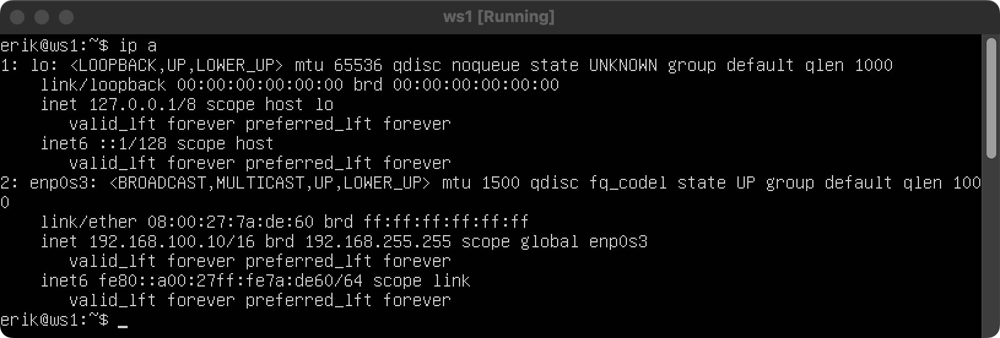
    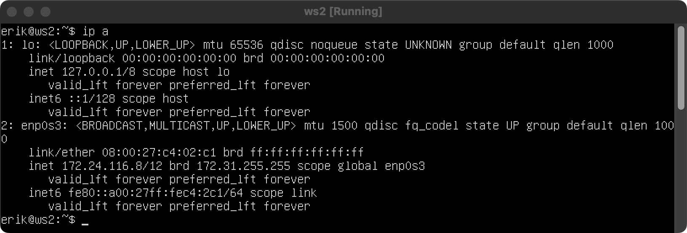
    
 

***

### 2.1. **Adding a static route manually**  

- **Task:** 
    - Add a static route from one machine to another and back using ip r add command  

- **Commands:**
    - `sudo ip r add 172.24.116.8 dev enp0s3` (ws1)  
    - `sudo ip r add 192.168.100.10 dev enp0s3` (ws2)  
    - `ip r show` 

- **Output:**     
    

    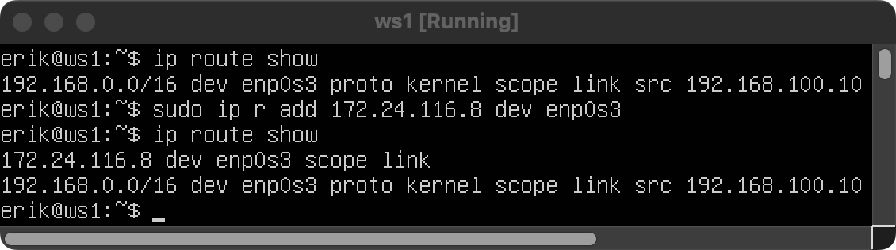
    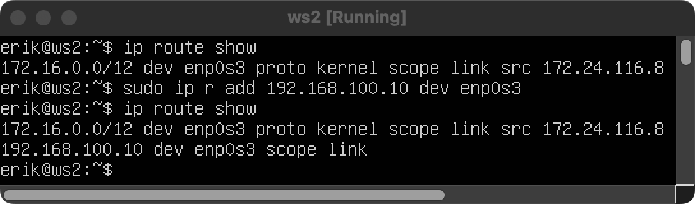 
 

    *** 
     

- **Task:** 
    - Ping the connection between the machines 

- **Commands:**
    - `ping -c 3 172.24.116.8` (ws1)  
    - `ping -c 3 192.168.100.10` (ws2)  

- **Output:**     
    

    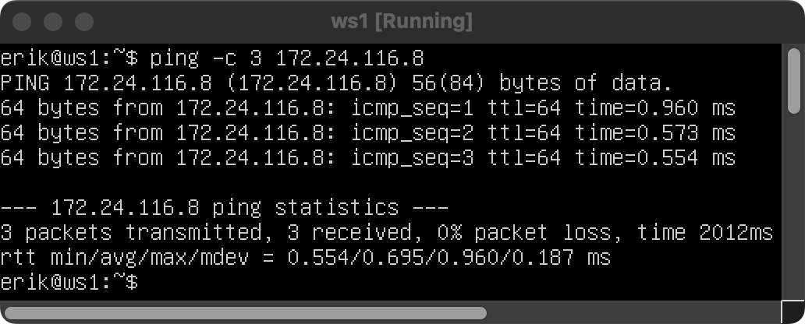
    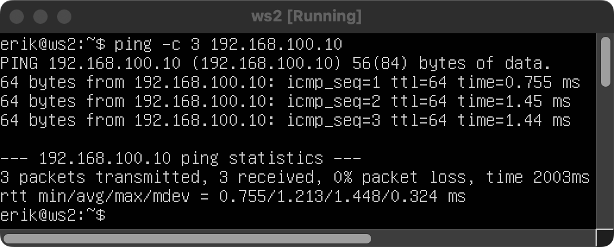 

*** 

### 2.2. **Adding a static route with saving**  

- **Task:** 
    - Restart the machines
    - Add static route from one machine to another using /etc/netplan/00-installer-config.yaml file 

- **Commands:**
    - `sudo reboot` 
    - `sudo nano /etc/netplan/00-installer-config.yaml`
    - `sudo netplan apply`

- **Output:**     
    

    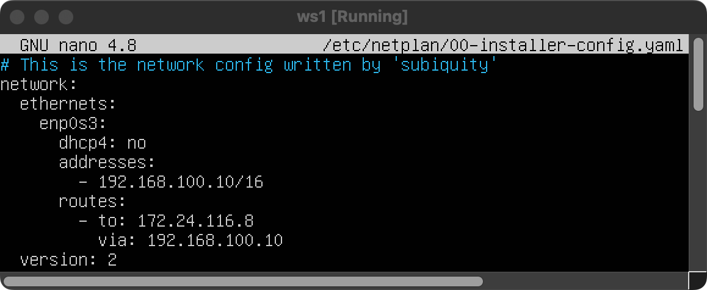
    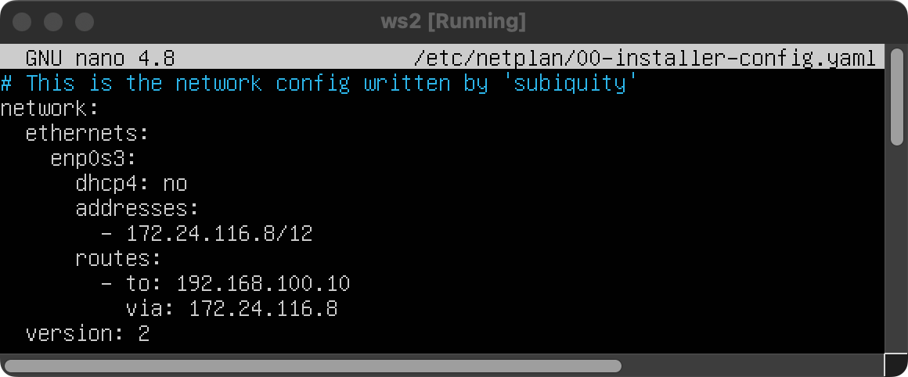 

    *** 
     

- **Task:** 
    - Ping the connection between the machines 

- **Commands:**
    - `ping -c 3 172.24.116.8` (ws1)  
    - `ping -c 3 192.168.100.10` (ws2)  

- **Output:**     
    

    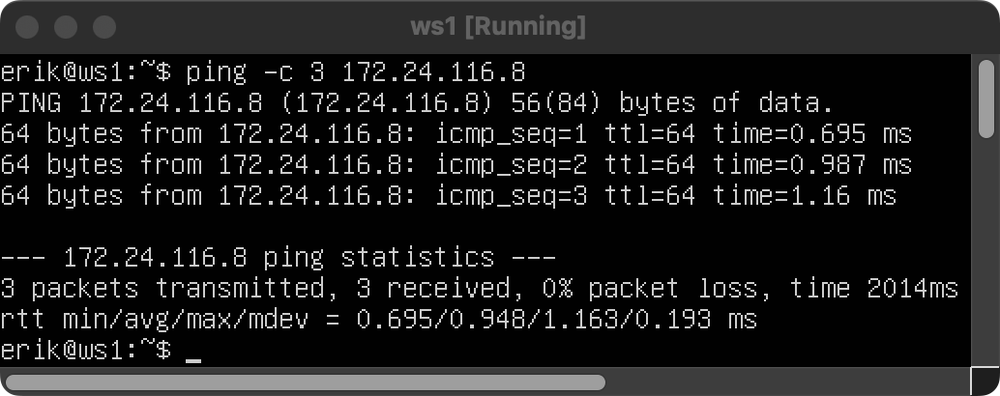
     
 

## 3. iperf3 utility

iperf3 is a program for performing real-time network throughput measurements

### 3.1. Connection speed

- 8 Mbps is 1 MB/s
- 100 MB/s is 800000 Kbps 
- 1 Gbps is 1000 Mbps

### 3.2. iperf3 utility

- **Task:** 
    - Measure connection speed between ws1 and ws2

- **Commands:**
    - `iperf3 -s` (ws1)  
    - `iperf3 -c 192.168.100.10` (ws2)  

- **Output:**      
    

    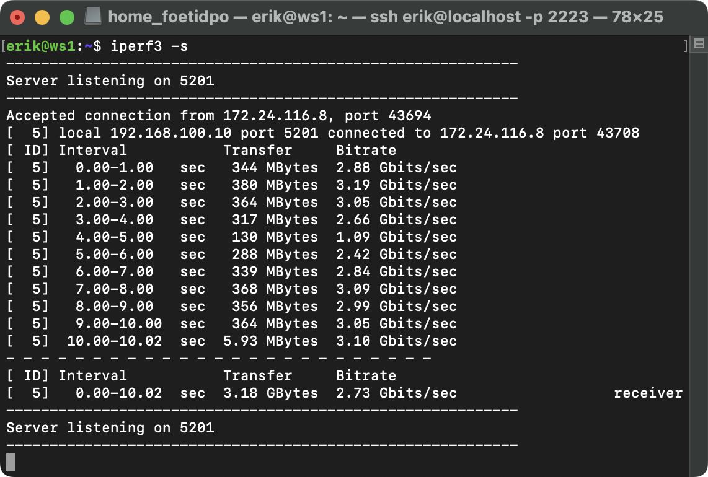
    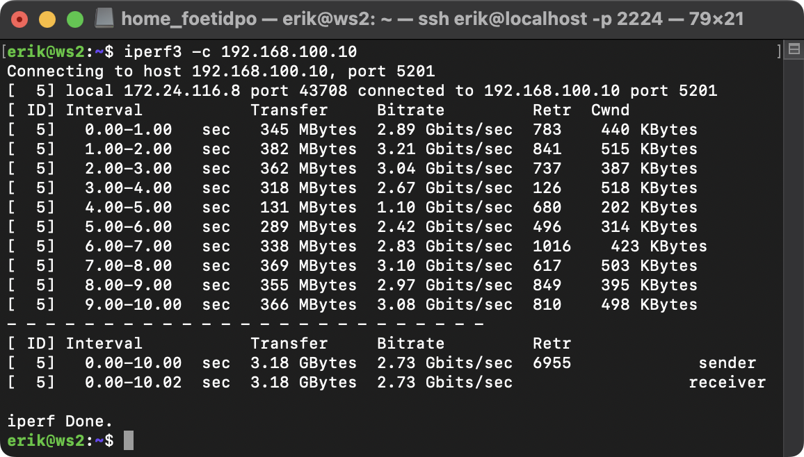 
 

## 4. Network firewall

### 4.1. iptables utility

iptables is a command-line firewall utility that uses policy chains to allow or block traffic.

- **Task:** 
    - Create a /etc/firewall.sh file simulating the firewall on ws1 and ws2
    - The following rules should be added to the file in a row:
        1) on ws1 apply a strategy where a deny rule is written at the beginning and an allow rule is written at the end (this applies to points 4 and 5)
        2) on ws2 apply a strategy where an allow rule is written at the beginning and a deny rule is written at the end (this applies to points 4 and 5)
        3) open access on machines for port 22 (ssh) and port 80 (http)
        4) reject echo reply (machine must not ping, i.e. there must be a lock on OUTPUT)
        5) allow echo reply (machine must be pinged)

- **Commands:**
    - `sudo touch /etc/firewall.sh`
    - `sudo nano /etc/firewall.sh`

- **Output:**
    

    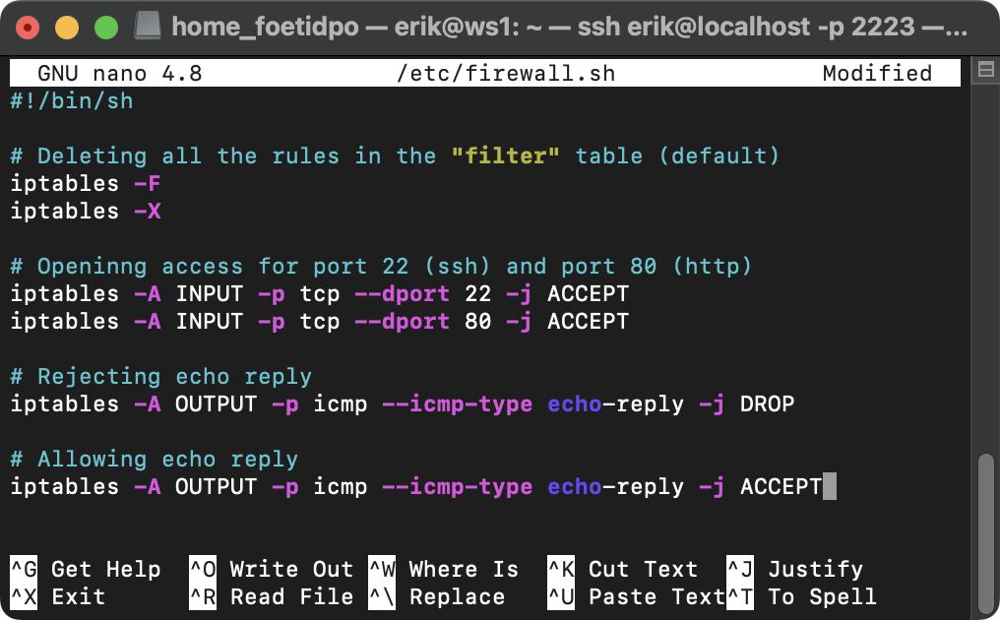
    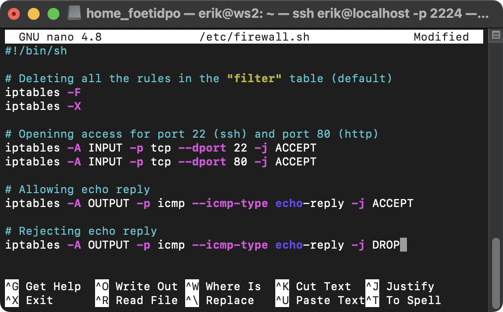
    
  

    *** 
     

- **Task:** 
    - Run the files on both machines with chmod +x /etc/firewall.sh and /etc/firewall.sh commands

- **Commands:**
    - `sudo chmod +x /etc/firewall.sh`
    - `sudo /etc/firewall.sh`

- **Output:**
    

    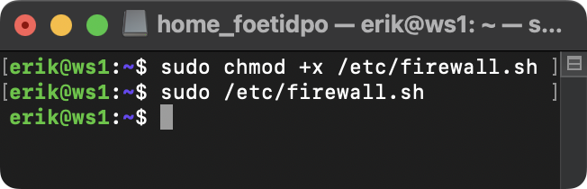
    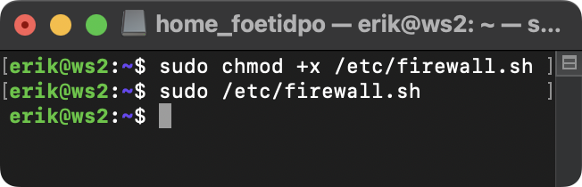 
  

- **Extra:**
    -  In the first file (ws1), a blocking rule is placed before an allowing rule, resulting in all ICMP echo reply packets being dropped. In the second file (ws2), an allowing rule is placed before a blocking rule, resulting in all ICMP echo reply packets being accepted. This demonstrates how the order of rules in iptables determines the behavior of network traffic, as only the first matching rule is applied

*** 

### 4.2. nmap utility

nmap is Linux command-line tool for network exploration and security auditing

- **Task:** 
    - Use ping command to find a machine which is not pinged, then use nmap utility to show that the machine host is up

- **Commands:**
    - `ping -c 3 172.24.116.8` (ws1)  
    - `ping -c 3 192.168.100.10` (ws2)  
    - `nmap 192.168.100.10` (ws2)  

- **Output:**
    

    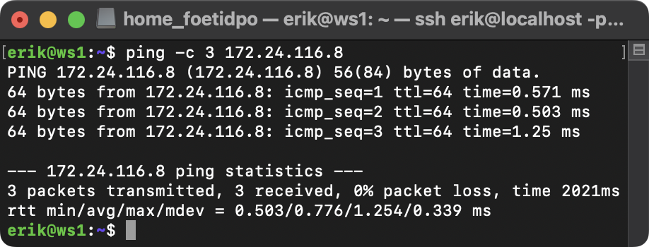
    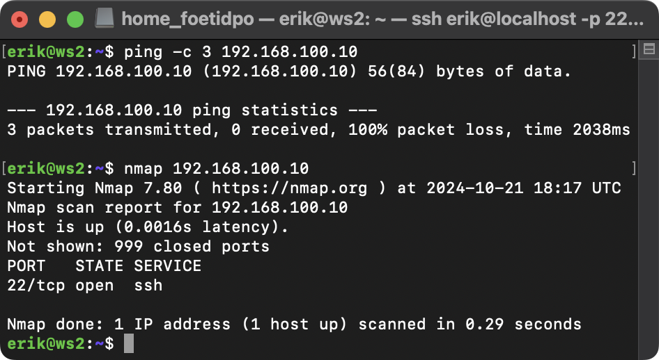
    
  

## 5. Static network routing

Start five virtual machines (3 workstations (ws11, ws21, ws22) and 2 routers (r1, r2))

<ul style="list-style-type: none;"> <li>

 

</li> </ul>

***

### 5.1. Configuration of machine addresses

- **Task:** 
    - Set up the machine configurations in etc/netplan/00-installer-config.yaml according to the network in the picture above

- **Command:**
    - `sudo nano /etc/netplan/00-installer-config.yaml`

- **Output:**     
    - Routers (r1 and r2):
    

    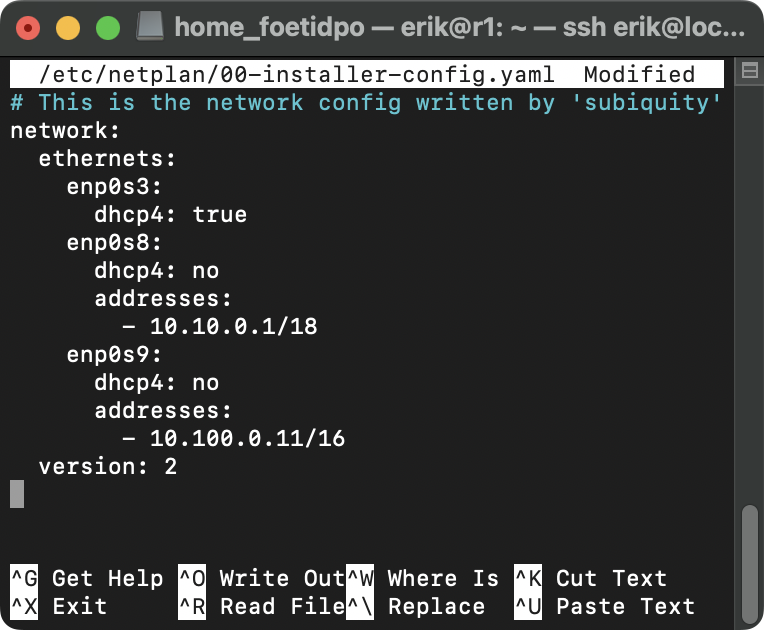
    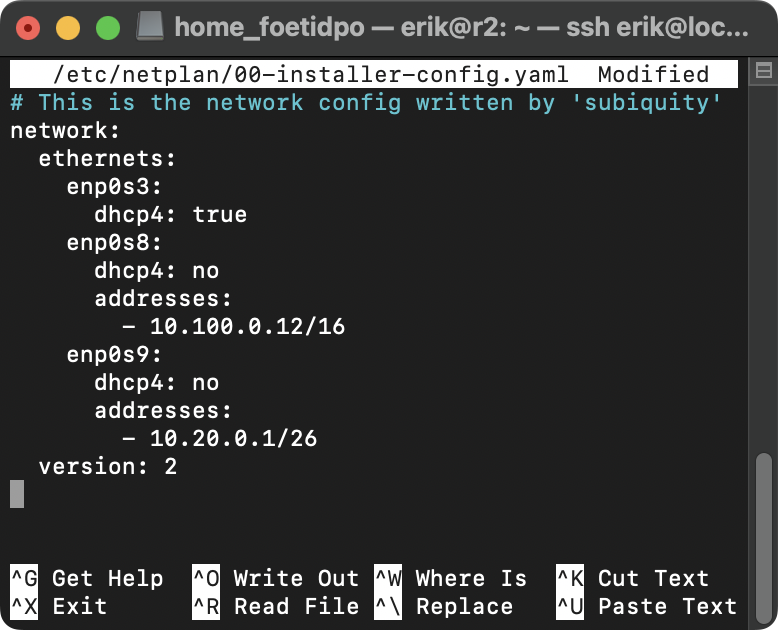
    
 

    - PCs (ws11, ws21 and ws22):
    

    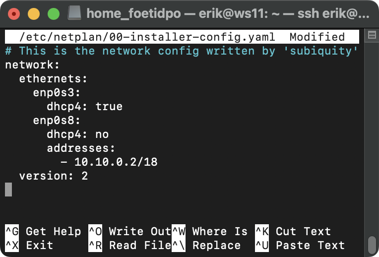
    
    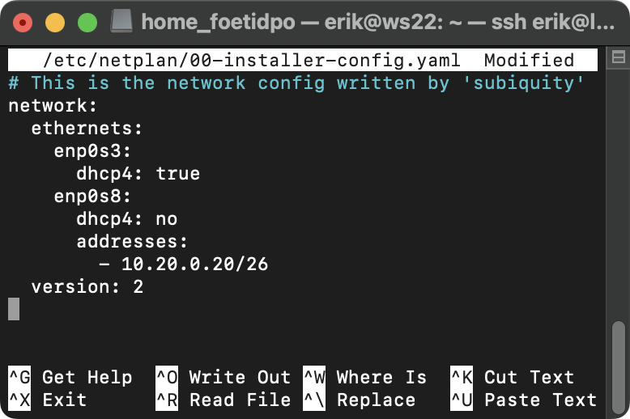
    
 

    ***
     

- **Task:** 
    - Restart the network service
    - If there are no errors, check that the machine address is correct with the ip -4 acommand

- **Commands:**
    - `sudo netplan apply`
    - `ip -4 a`

- **Output:**     
    - Routers (r1 and r2):
    

    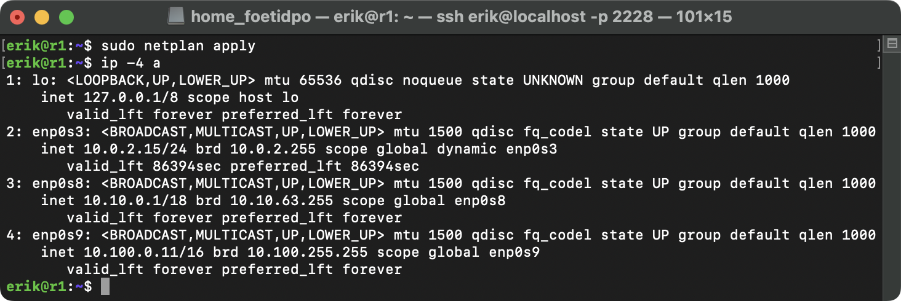
    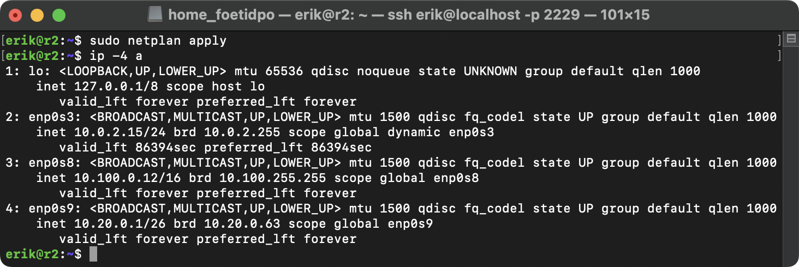
    
 

    - PCs (ws11, ws21 and ws22):
    

    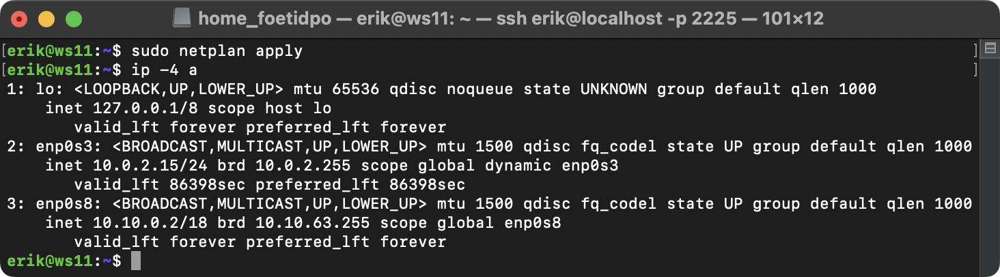
    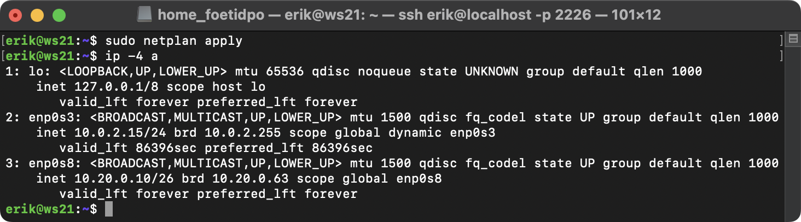
    
    
 

    ***
     

- **Task:** 
    - Ping ws22 from ws21

- **Command:**
    - `ping -c 3 10.20.0.20`

- **Output:**     
    

    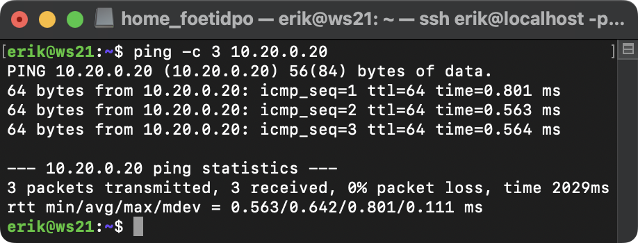 

    ***
     

- **Task:** 
    - Ping r1 from ws11

- **Command:**
    - `ping -c 3 10.10.0.1`

- **Output:**     
    

    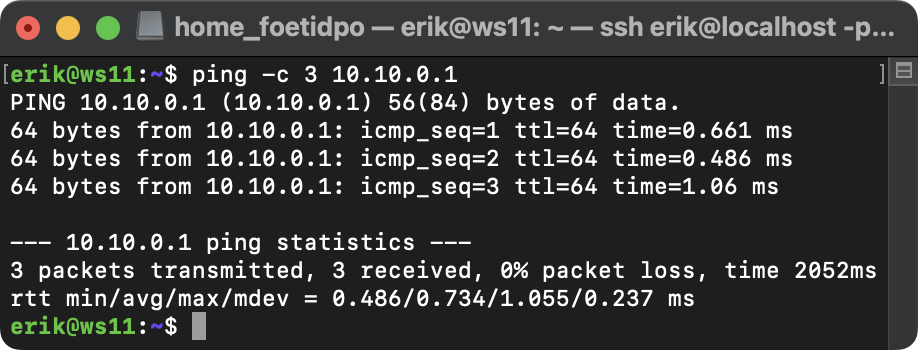 
  

***     

### 5.2. Enabling IP forwarding

IP forwarding is the process by which a network device (such as a router or computer) forwards network packets between different network interfaces. Enabling IP forwarding allows the device to act as a router, directing traffic between multiple networks

- **Task:** 
    - To enable IP forwarding, run the following command on the routers

- **Command:**
    - `sudo sysctl -w net.ipv4.ip_forward=1`

- **Output:**     
    

    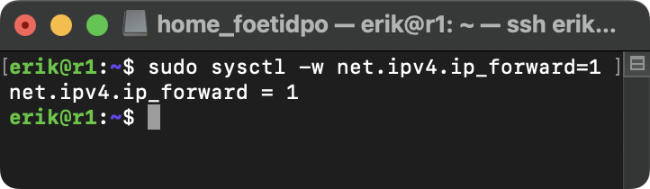
    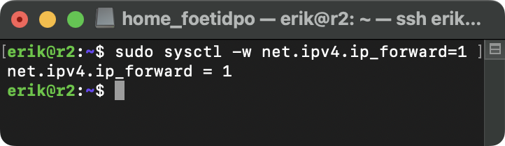 

- **Extra:** 
    - With this approach, the forwarding will not work after the system is rebooted    

    ***
     

- **Task:** 
    - Open /etc/sysctl.conf file and add line net.ipv4.ip_forward = 1

- **Command:**
    - `sudo nano /etc/sysctl.conf`

- **Output:**     
    

    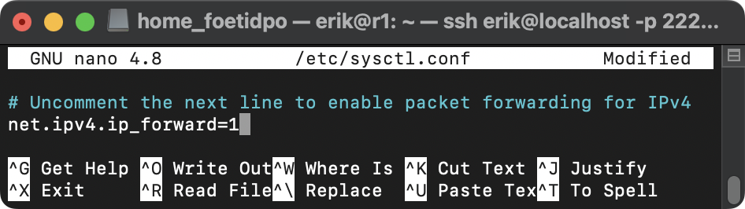
    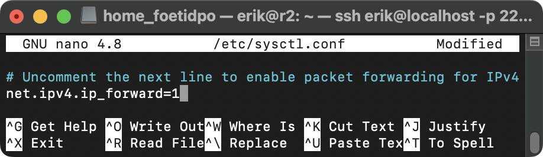 
  

- **Extra:** 
    - With this approach, IP forwarding is enabled permanently

***    

### 5.3. Default route configuration

- **Task:** 
    - Configure the default route (gateway) for the workstations
    - To do this, add default before the router's IP in the configuration file

- **Commands:**
    - `sudo nano /etc/netplan/00-installer-config.yaml`
    - `sudo netplan apply`

- **Output:**     
    

    
    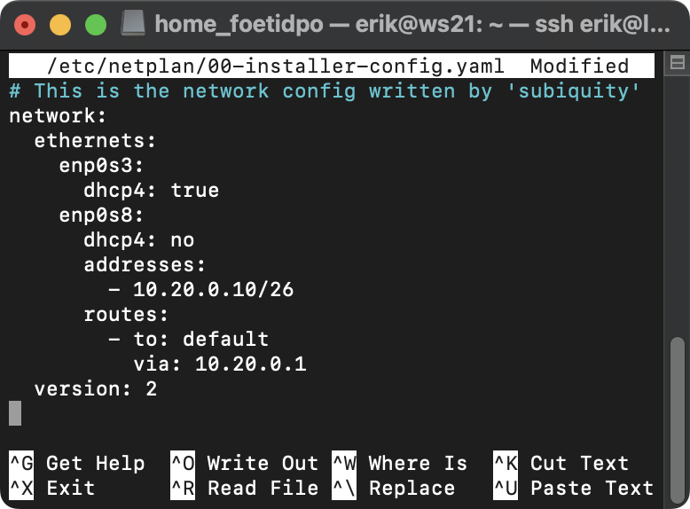
    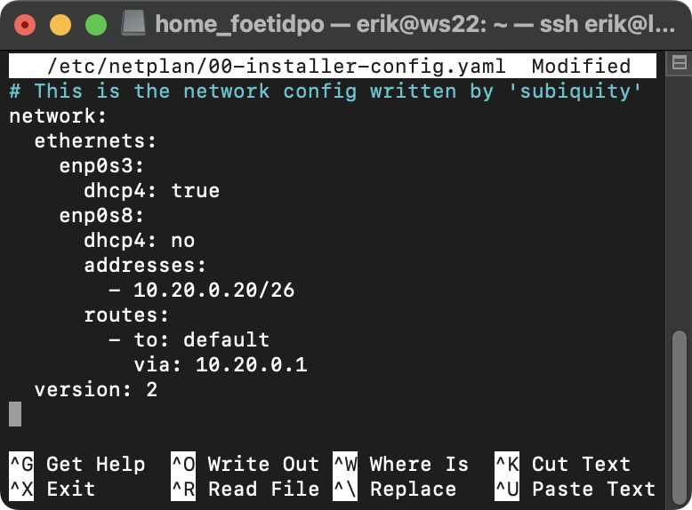
    
 

    ***
         

- **Task:** 
    - Call ip r and show that a route is added to the routing table

- **Command:**
    - `ip r`

- **Output:**     
    

    
    
    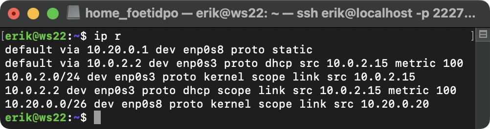
    
 

    ***
       

- **Task:** 
    - Ping r2 router from ws11 and show on r2 that the ping is reaching

- **Commands:**
    - `tcpdump -tn -i enp0s8` (r2)
    - `ping -c 5 10.100.0.12` (ws11)

- **Output:**     
    

    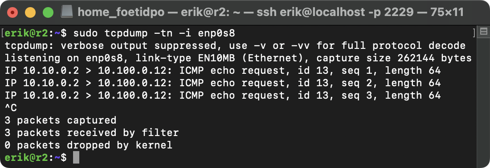
    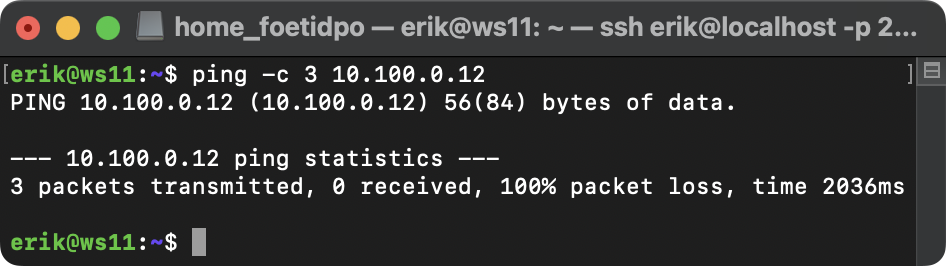
    
 

- **Extra:**
    - *tcpdump* is a network packet analyzer that allows to capture and inspect traffic flowing through a network interface in real-time    

***

### 5.4. Adding static routes

- **Task:** 
    - Add static routes to r1 and r2 in configuration file

- **Commands:**
    - `sudo nano /etc/netplan/00-installer-config.yaml`
    - `sudo netplan apply`

- **Output:**     
    

    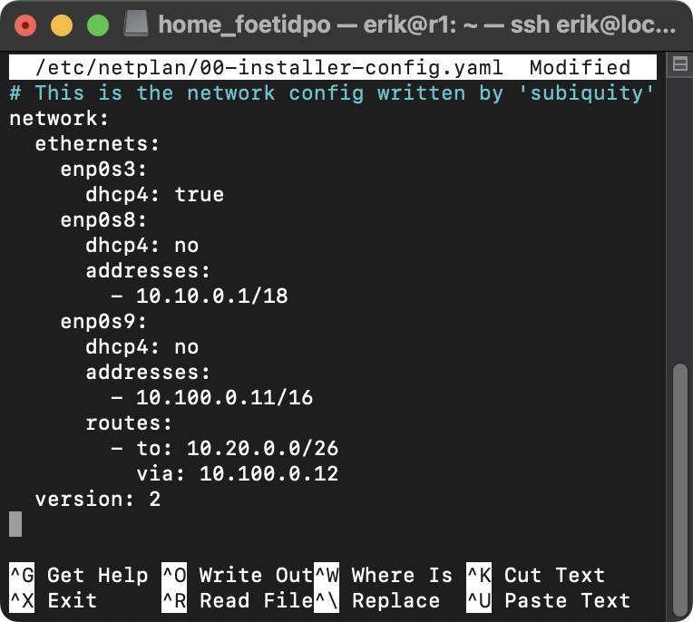
    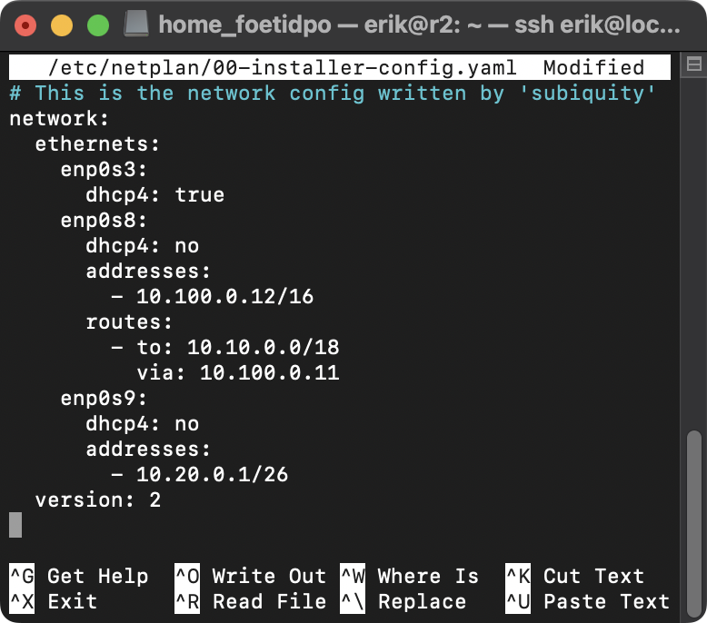
    
 

    ***
        

- **Task:** 
    - Call ip r and show route tables on both routers

- **Command:**
    - `ip r`

- **Output:**     
    

    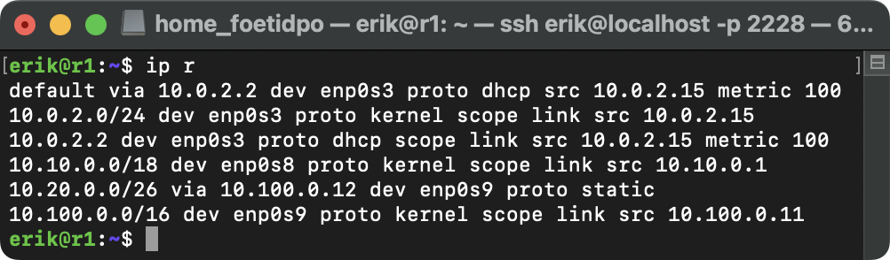
    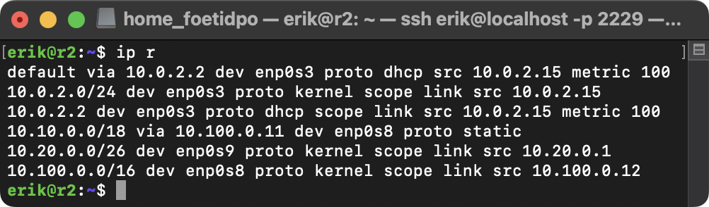
    
 

    ***
            

- **Task:** 
    - Run ip r list 10.10.0.0/[netmask] and ip r list 0.0.0.0/0 commands on ws11

- **Commands:**
    - `ip r list 10.10.0.0/18`
    - `ip r list 0.0.0.0/0`

- **Output:**     
    

    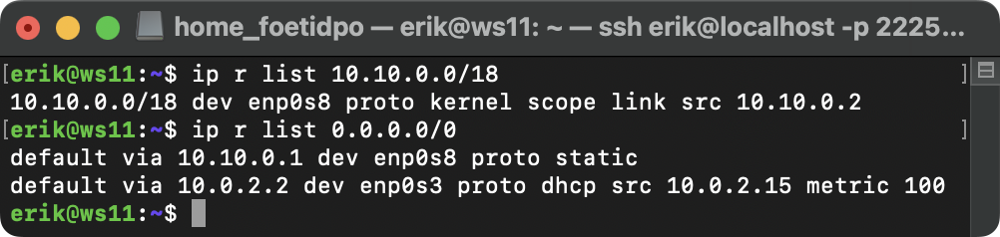 

- **Extra:** 
    - For the address 10.10.0.0/18, a route other than 0.0.0.0/0 was selected (it falls under the default route) becase routing decisions in IP networks are based on the longest prefix match rule. This means that when a router decides how to forward a packet, it looks for the most specific route (i.e., the route with the longest subnet mask) that matches the destination IP address

***

### 5.5. Making a router list

- **Task:** 
    - Run the tcpdump -tnv -i enp0s8 dump command on r1
    - Use traceroute utility to list routers in the path from ws11 to ws21

- **Commands:**
    - `sudo tcpdump -tnv -i enp0s8` (r1)
    - `traceroute 10.20.0.10` (ws11)

- **Output:**     
    

    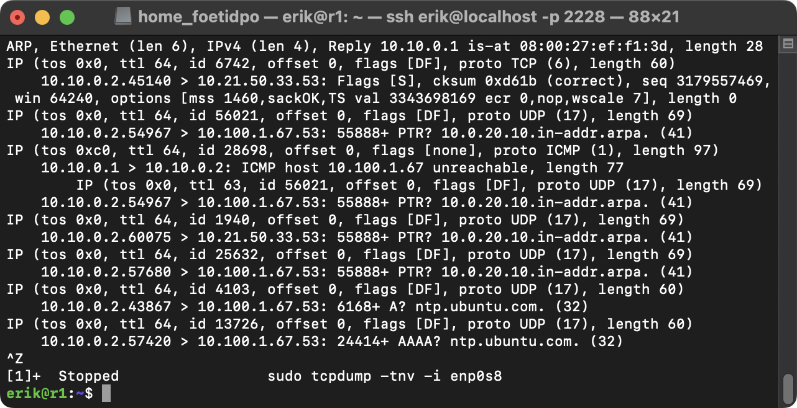
    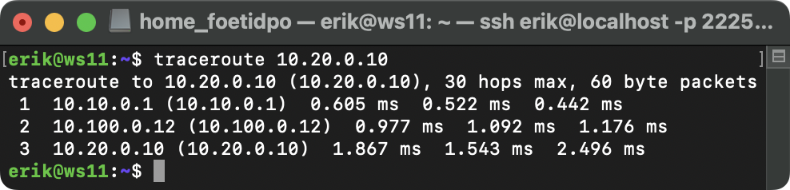 

- **Extra:** 
    - *traceroute* is a network diagnostic tool used to track the path that packets take from the source host to a destination host
    - *traceroute* works by sending packets with gradually increasing Time-to-Live (TTL) values to a target IP address. Each time a packet reaches a router, the TTL is decremented by 1. When the TTL reaches 0, the router discards the packet and sends back an ICMP Time Exceeded message. Traceroute records the IP address of each router and the round-trip time for each hop. This process continues until the target address is reached, allowing the user to see the complete path and delays at each stage

***    

### 5.6. Using ICMP protocol in routing

- **Task:** 
    - Run on r1 network traffic capture going through enp0s8 with the tcpdump -n -i enp0s8 icmp command
    - Ping a non-existent IP (e.g. 10.30.0.111) from ws11 with the ping -c 1 10.30.0.111 command

- **Commands:**
    - `sudo tcpdump -n -i enp0s8 icmp` (r1)
    - `ping -c 1 10.30.0.111` (ws11)

- **Output:**     
    

    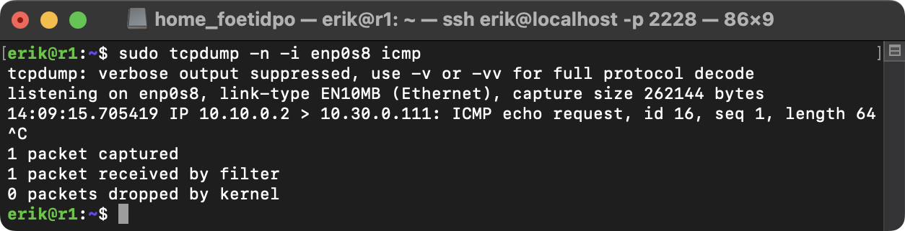
    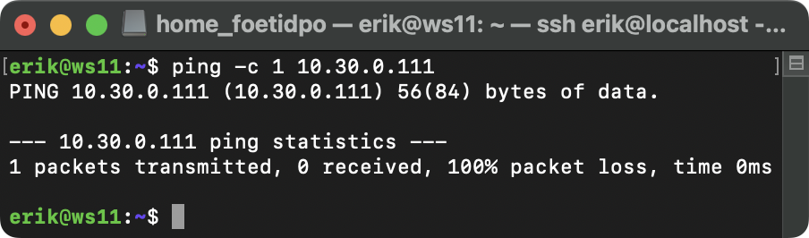 

- **Extra:**
    - *ICMP* protocol is an error notification protocol
    - TCP/IP stack has a special messaging mechanism to allow routers to notify network nodes of errors or abnormal situations, called the Internet Control Message Protocol

## 6. Dynamic IP configuration using DHCP

DHCP is a TCP/IP model application layer protocol used to assign an IP address to a client

- **Task:** 
    - For r2, configure the DHCP service in the /etc/dhcp/dhcpd.conf file: 
        - Specify the default router address, DNS-server and internal network address
    - Write nameserver 8.8.8.8 in a resolv.conf file

- **Commands:**
    - `sudo nano /etc/dhcp/dhcpd.conf` 
    - `sudo nano /etc/resolv.conf`

- **Output:**     
    

    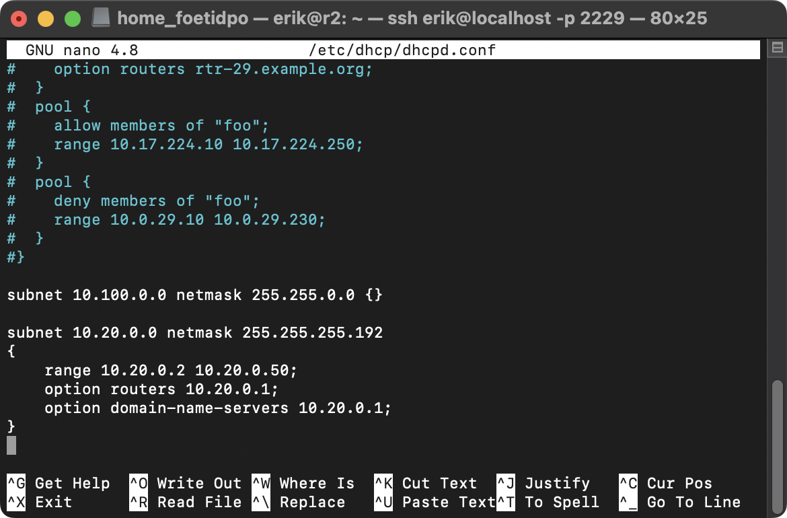
    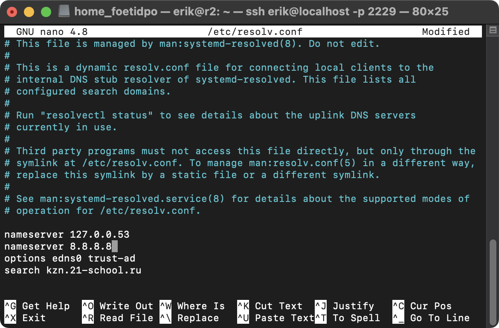 

- **Extra:** 
    - In summary, this DHCP configuration allows devices on the 10.20.0.0/26 subnet to:
        - *range* - receive IP addresses from a specified range
        - *option routers* - set their default gateway to 10.20.0.1 (this option specifies the default gateway (router) for clients on the network)
        - *option domain-name-servers* - use that same address as their DNS server (this option provides the DNS server address to the DHCP clients)
    - The line *nameserver 8.8.8.8* in a resolv.conf file specifies a DNS (Domain Name System) server that system will use to resolve domain names into IP addresses

    ***
       

- **Task:** 
    - Restart the DHCP service on r2 with systemctl restart isc-dhcp-server  

- **Command:**
    - `systemctl restart isc-dhcp-server` 

- **Output:**     
    

    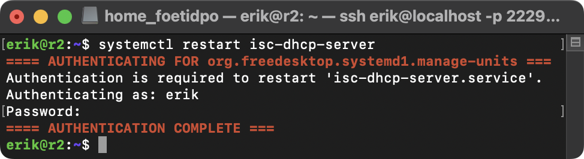 

    ***
           

- **Task:** 
    - Reboot the ws21 machine with reboot and show with ip a that it has got an address

- **Commands:**
    - `sudo reboot` 
    - `ip a` 

- **Output:**     
    

    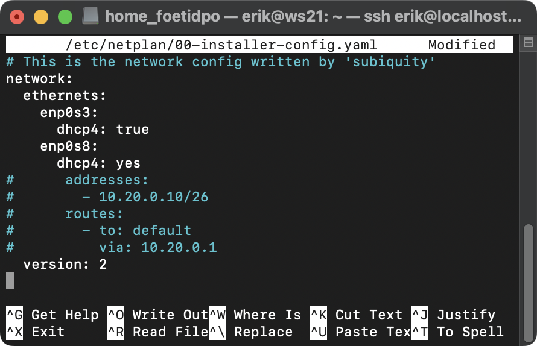 
     

    

    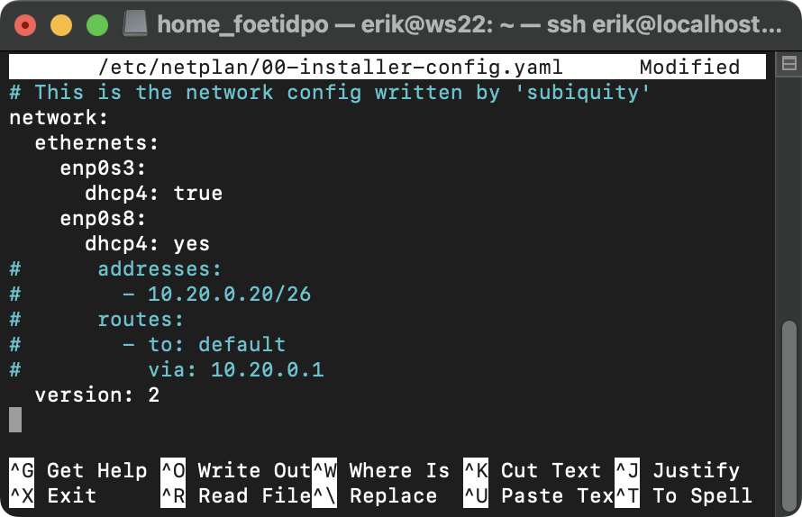 
    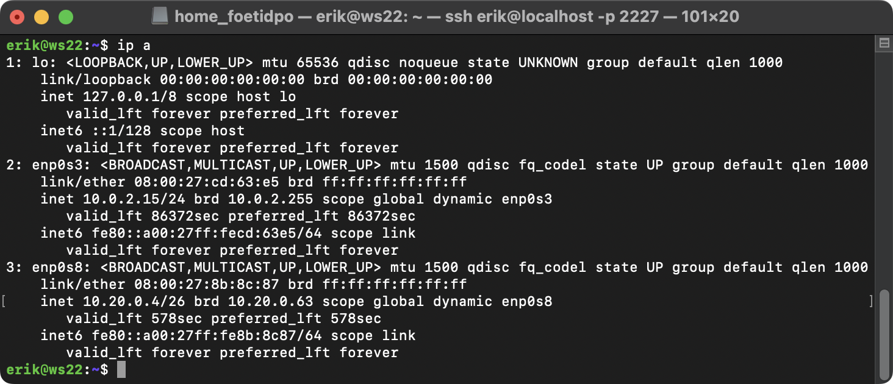 

    

- **Extra:** 
    - To allow the network interface to obtain an IP address and other network settings dynamically from a DHCP server, it is also necessary to modify the network configuration by enabling DHCP for IPv4 (dhcp4: yes)

    ***
         

- **Task:** 
    - Ping ws22 from ws21

- **Command:**
    - `ping -c 3 10.20.0.4` 

- **Output:**     
    

    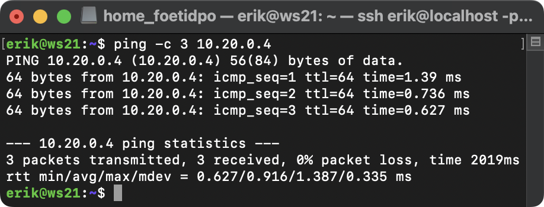  

    ***
          

- **Task:** 
    - Specify MAC address at ws11 by adding to etc/netplan/00-installer-config.yaml: macaddress: 10:10:10:10:10:BA, dhcp4: true

- **Commands:**
    - `sudo nano /etc/netplan/00-installer-config.yaml` 
    - `sudo netplan apply` 

- **Output:**     
    

    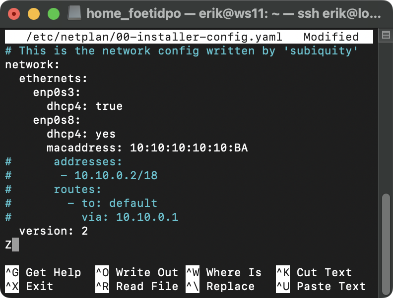  

    ***
          

- **Task:** 
    - Сonfigure r1 the same way as r2, but make the assignment of addresses strictly linked to the MAC-address (ws11)

- **Commands:**
    - `sudo nano /etc/dhcp/dhcpd.conf` 
    - `sudo nano /etc/resolv.conf` 

- **Output:**     
    

    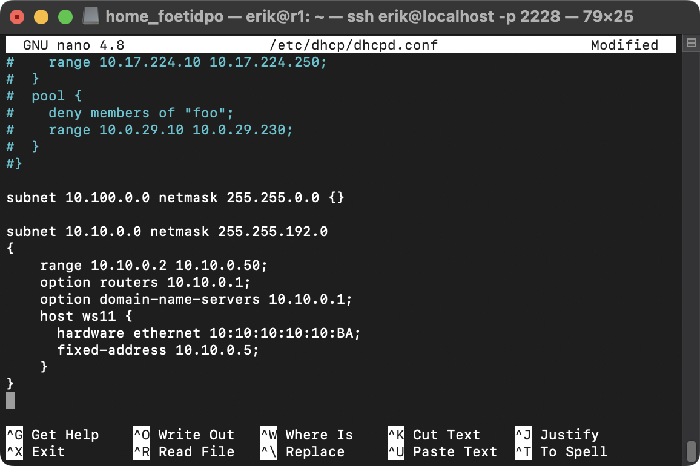
    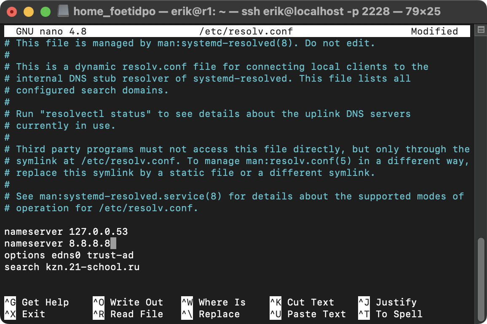 

    ***
          

- **Task:** 
    - Restart the DHCP service on r1 with systemctl restart isc-dhcp-server  

- **Command:**
    - `systemctl restart isc-dhcp-server` 

- **Output:**     
    

    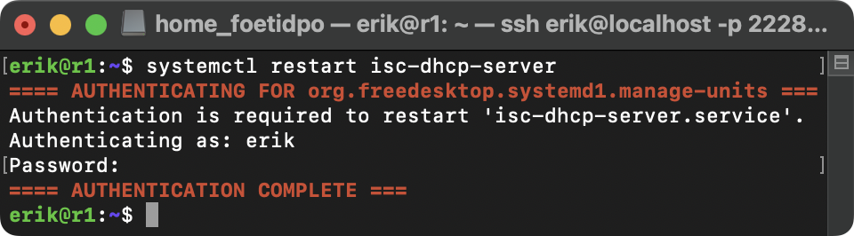 

    ***
             

- **Task:** 
    - Reboot the ws11 machine with reboot and show with ip a that it has got an address

- **Commands:**
    - `sudo reboot` 
    - `ip a` 

- **Output:**     
    

    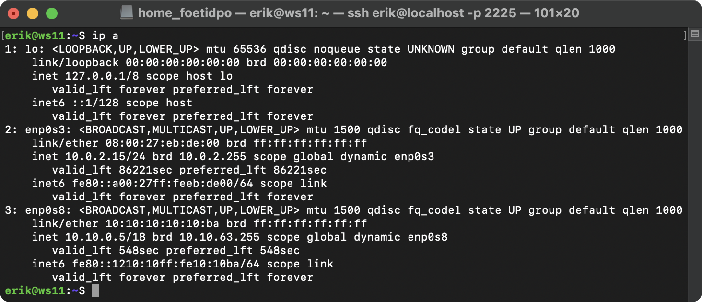 

    ***
          

- **Task:** 
    - Ping ws11 from r1

- **Command:**
    - `ping -c 3 10.10.0.5`  

- **Output:**     
    

    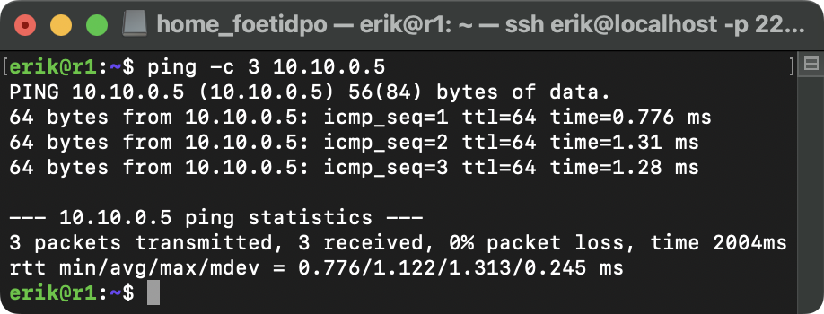 

    ***
           

- **Task:** 
    - Request IP address update from ws21

- **Commands:**
    - `sudo dhclient -r enp0s8`  
    - `sudo dhclient enp0s8`  
    - `ip a`  

- **Output:**     
    - Before: 
    

    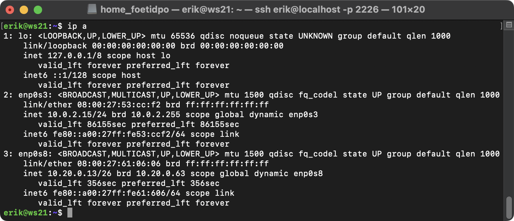 

    - After:
    

    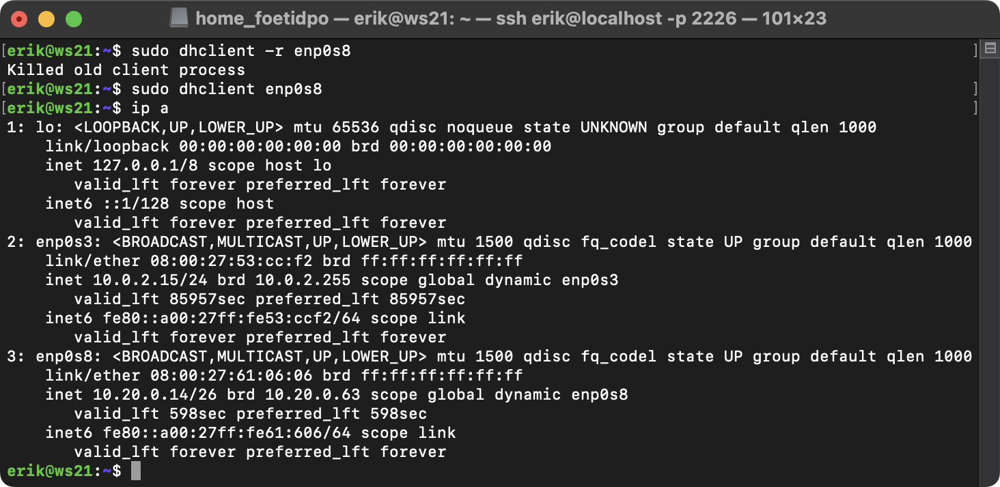 

## 7. NAT

NAT (Network Address Translation) is a process used in routers to modify network address information in IP packet headers while they are in transit. It allows multiple devices on a private network to share a single public IP address for accessing external networks, like the internet

- **Task:** 
    - In /etc/apache2/ports.conf file change the line Listen 80 to Listen 0.0.0.0:80 on ws22 and r1, i.e. make the Apache2 server public

- **Command:**
    - `sudo nano /etc/apache2/ports.conf` 

- **Output:**     
    

    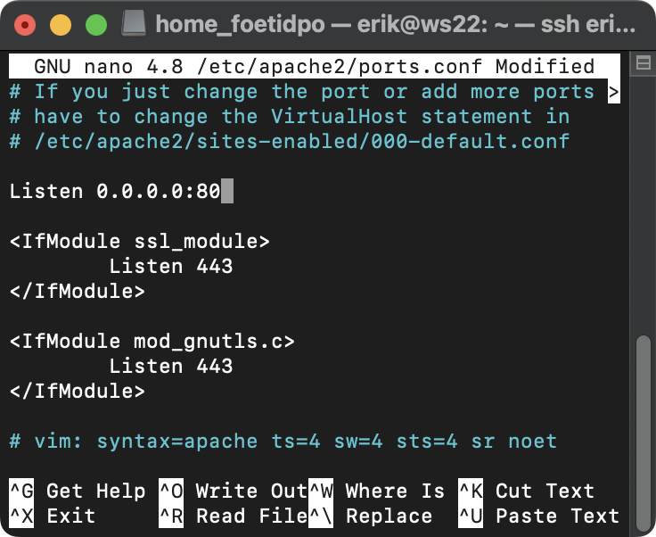 
    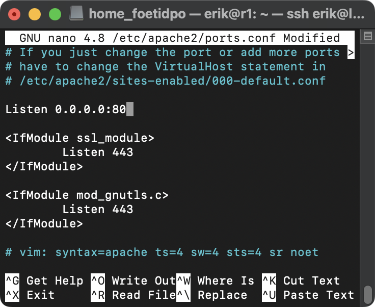 
   

- **Extra:**
    - By changing Listen 80 to Listen 0.0.0.0:80, it makes the Apache2 server public and allowing it to serve requests from the wider internet, not just the local network    

    ***
          
    
- **Task:** 
    - Start the Apache web server with service apache2 start command on ws22 and r1

- **Command:**
    - `service apache2 start` 

- **Output:**     
    

    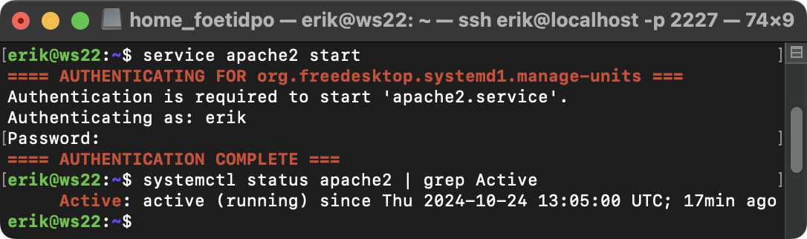 
    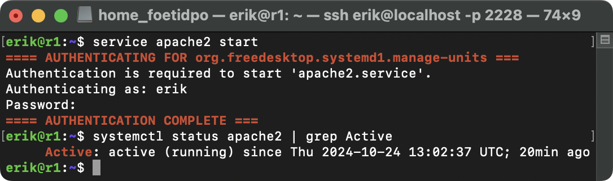 
   

    ***
          

- **Task:** 
    - Add the following rules to the firewall, created similarly to the firewall from [4](#4-network-firewall), on r2:
        1) delete rules in the filter table — iptables -F
        2) delete rules in the "NAT" table — iptables -F -t nat
        3) drop all routed packets — iptables --policy FORWARD DROP

    - Run the file as in [4](#4-network-firewall)

- **Commands:**
    - `sudo touch /etc/firewall.sh`
    - `sudo nano /etc/firewall.sh`
    - `sudo chmod +x /etc/firewall.sh`
    - `sudo /etc/firewall.sh`

- **Output:**     
    

    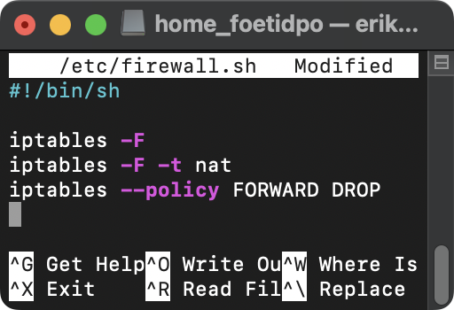 
    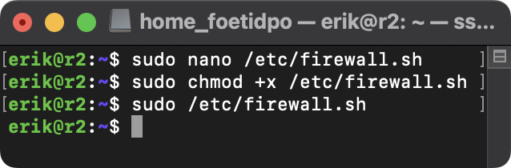 
   

    ***
           

- **Task:** 
    - Check the connection between ws22 and r1 with the ping command

- **Commands:**
    - `ping -c 3 10.20.0.15` (r1)
    - `ping -c 3 10.10.0.1` (ws22)

- **Output:**     
    

    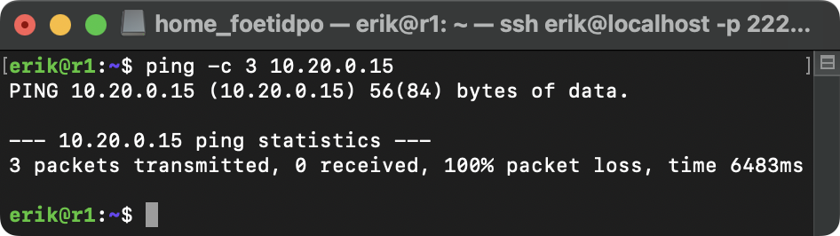 
    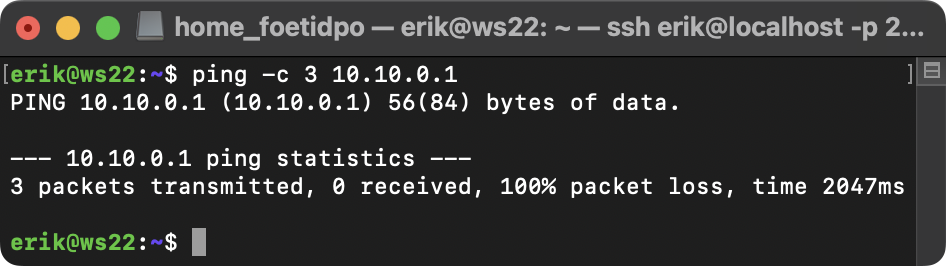 
  

- **Extra:**
    - When running the file with these rules, ws22 should not ping from r1

    ***
          

- **Task:** 
    - Add another rule to the file:  
        - allow routing of all ICMP protocol packets

    - Run the file as in [4](#4-network-firewall)

- **Commands:**
    - `sudo nano /etc/firewall.sh`
    - `sudo chmod +x /etc/firewall.sh`
    - `sudo /etc/firewall.sh`

- **Output:**     
    

    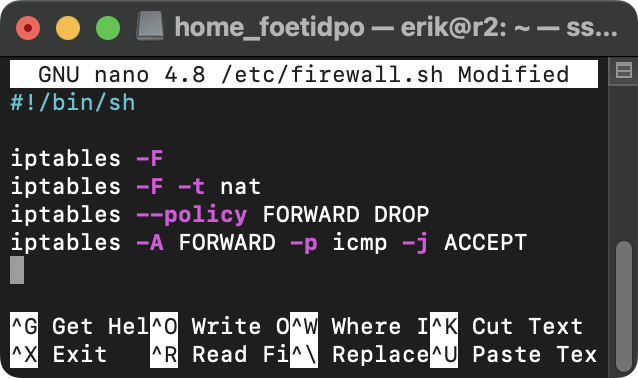 
    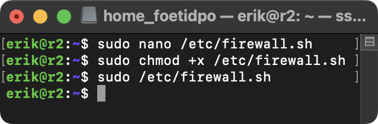 
   

    ***
            

- **Task:** 
    - Check connection between ws22 and r1 with the ping command

- **Commands:**
    - `ping -c 3 10.20.0.15` (r1)
    - `ping -c 3 10.10.0.1` (ws22)

- **Output:**     
    

    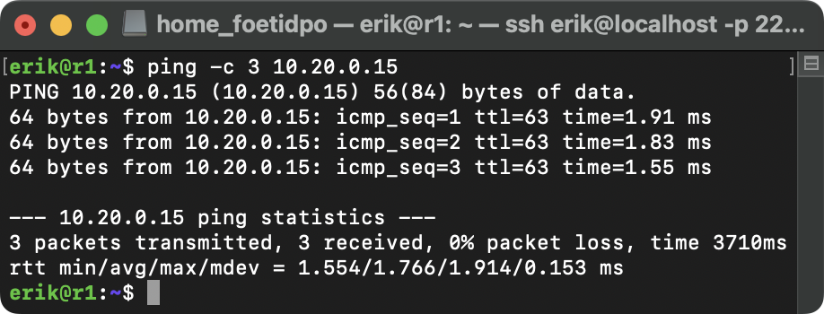 
    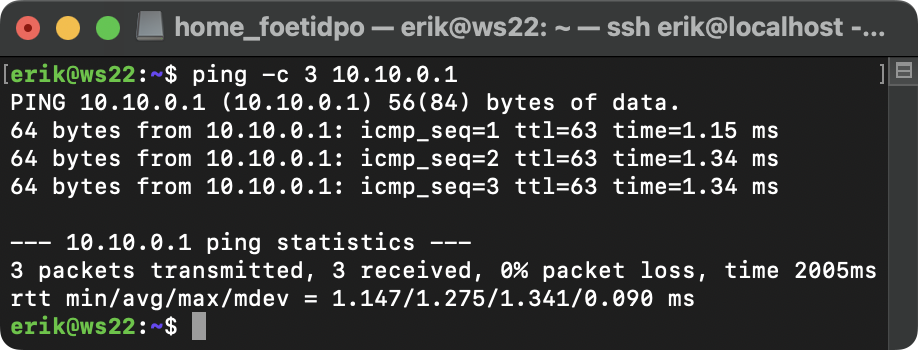 
  

- **Extra:**
    - When running the file with these rules, ws22 should ping from r1     

    ***
        

- **Task:** 
    - Add two more rules to the file:
        - enable SNAT, which is masquerade all local IP from the local network behind r2 (as defined in [5](#5-static-network-routing) — network 10.20.0.0)
        - enable DNAT on port 8080 of r2 machine and add external network access to the Apache web server running on ws22

    - Run the file as in [4](#4-network-firewall)

- **Commands:**
    - `sudo nano /etc/firewall.sh`
    - `sudo chmod +x /etc/firewall.sh`
    - `sudo /etc/firewall.sh`

- **Output:**     
    

    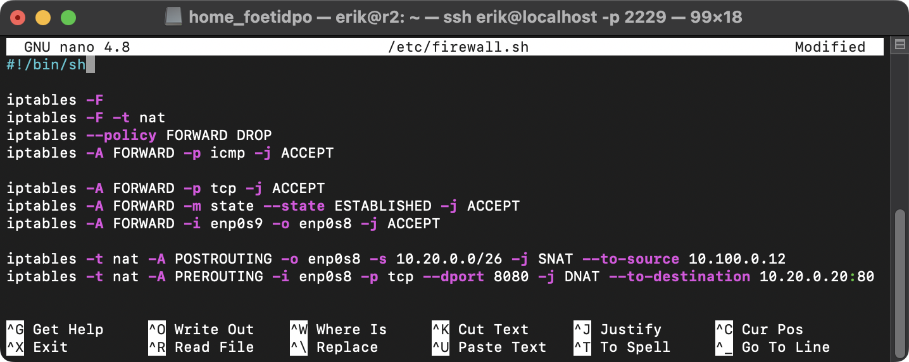 
    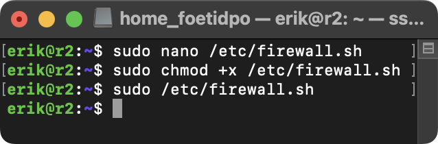 
   

- **Extra:**
    - *SNAT* (Source NAT) is a technique used to modify the source IP address of packets as they leave a network. It is commonly used in situations where multiple devices on a local network share a single public IP address. When packets are sent out, SNAT replaces the original source IP with the public IP of the router, allowing responses to be correctly routed back to the originating device

    - *DNAT* (Destination NAT) is a method of modifying the destination IP address of incoming packets. It is typically used to direct external traffic to specific devices within a private network. When a packet arrives at the router destined for a public IP, DNAT changes the destination address to a private IP address, allowing the traffic to reach the intended internal device, such as a server

    - *iptables* flags:
        - -A - append a rule to the specified chain (e.g., FORWARD)  
        - -p - specifies the protocol (e.g., tcp, icmp)
        - -j - jump to a target action (e.g., ACCEPT, SNAT, DNAT)
        - -m - load a module for matching packets (e.g., state)
        - --state - used with the state module to specify the connection state (e.g., ESTABLISHED)
        - -i - specifies the incoming interface for the packets
        - -o - specifies the outgoing interface for the packets
        - -s - specifies the source IP address or network
        - --to-source - sets the new source IP address for SNAT
        - --to-destination - sets the new destination IP address for DNAT
        - -t nat - specifies the nat table for NAT rules (e.g., POSTROUTING, PREROUTING)  

    ***
          

- **Task:** 
    - Check the TCP connection for SNAT by connecting from ws22 to the Apache server on r1 with the telnet [address] [port] command

- **Commands:**
    - `telnet 10.10.0.1 80` (ws22)
    - `sudo tcpdump -tn -i enp0s9` (r1)

- **Output:**     
    

    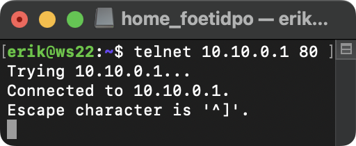 
    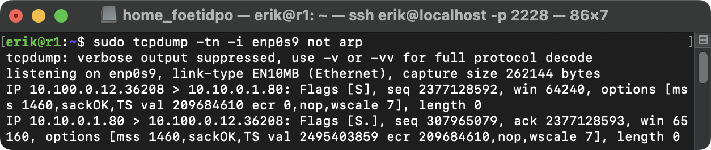  
  

- **Extra:**
    - *telnet* is a network protocol used to provide a command-line interface for communication with a remote device or server. It allows users to connect to a remote host over the TCP protocol
    ***
     

- **Task:** 
    - Check the TCP connection for DNAT by connecting from r1 to the Apache server on ws22 with the telnet command (address r2 and port 8080)

- **Commands:**
    - `telnet 10.20.0.1 8080` (r1)
    - `sudo tcpdump -tn -i enp0s8 port 80` (ws22)

- **Output:**     
    

    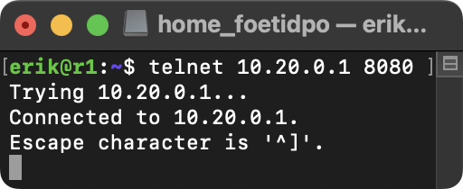 
    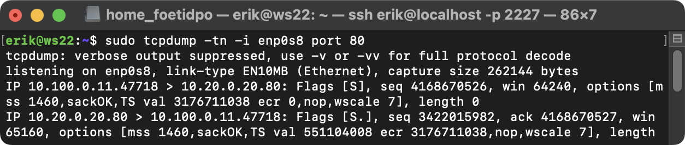 
  

- **Extra:** 
    - Since a static IP address has been configured for ws22 in the firewall file, the automatic DHCP assignment should now be disabled in the /etc/netplan/00-installer-config.yaml file on ws22 (if it is enabled). This also applies to the other two machines

## 8. SSH Tunnels  

- **Task:** 
    - Run a firewall on r2 with the rules from [7](#7-nat)
    - Start the Apache web server on ws22 on localhost only (i.e. in /etc/apache2/ports.conf file change the line Listen 80 to Listen localhost:80)

- **Commands:**
    - `sudo chmod +x /etc/firewall.sh` (r2)
    - `sudo /etc/firewall.sh` (r2)
    - `sudo nano /etc/apache2/ports.conf` (ws22)
    - `service apache2 start` (ws22)

- **Output:**     
    

    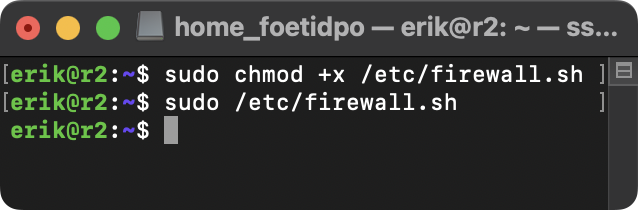
    
    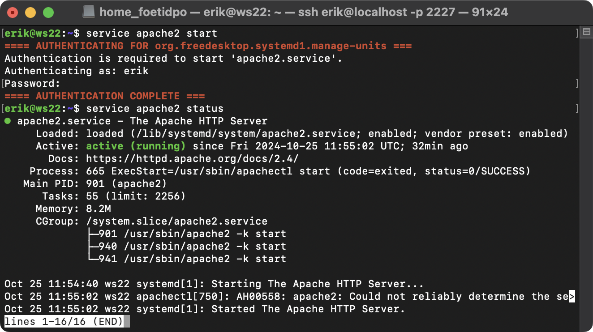 
  

    ***
     

- **Task:** 
    - Use Local TCP forwarding from ws21 to ws22 to access the web server on ws22 from ws21
    - To check if the connection worked, go to a second terminal and run the telnet 127.0.0.1 [local port] command

- **Commands:**
    - `ssh -L 8080:localhost:80 10.20.0.20` (ws21)
    - `telnet 127.0.0.1 8080` (ws21)

- **Output:**     
    

    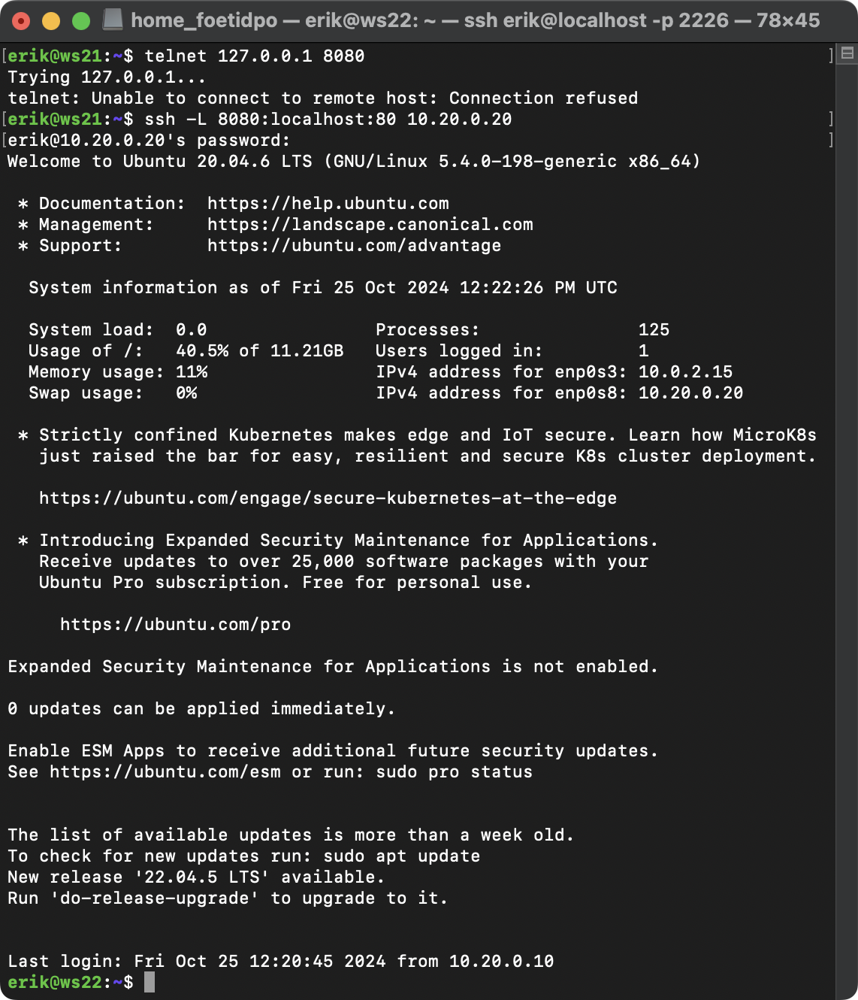 
    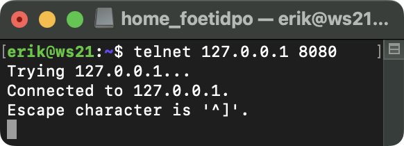 
 

- **Extra:**
    - *Local TCP forwarding* allows to forward traffic from a port on the local machine to a remote machine over an SSH connection 

    - Command template: ssh -L [local_host:]local_port:remote_host:remote_port [user@]remote_server

    - From ws21, when localhost:8080 is visited, SSH intercepts this request, forwards it to ws22, and sends it to port 80 on ws22 where the web server is listening. ws22 then processes the request and sends the response back through the SSH tunnel, making it appear as though the web server is available on localhost:8080 on ws21   

    - 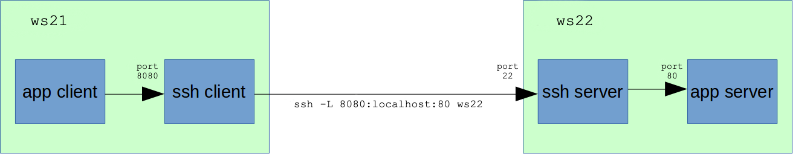   

    ***
     

- **Task:** 
    - Use Remote TCP forwarding from ws11 to ws22 to access the web server on ws22 from ws11
    - To check if the connection worked, run the telnet 127.0.0.1 [local port] command

- **Commands:**
    - `ssh -R 8080:localhost:80 10.10.0.2` (ws22)
    - `telnet 127.0.0.1 8080` (ws11)

- **Output:**     
    

    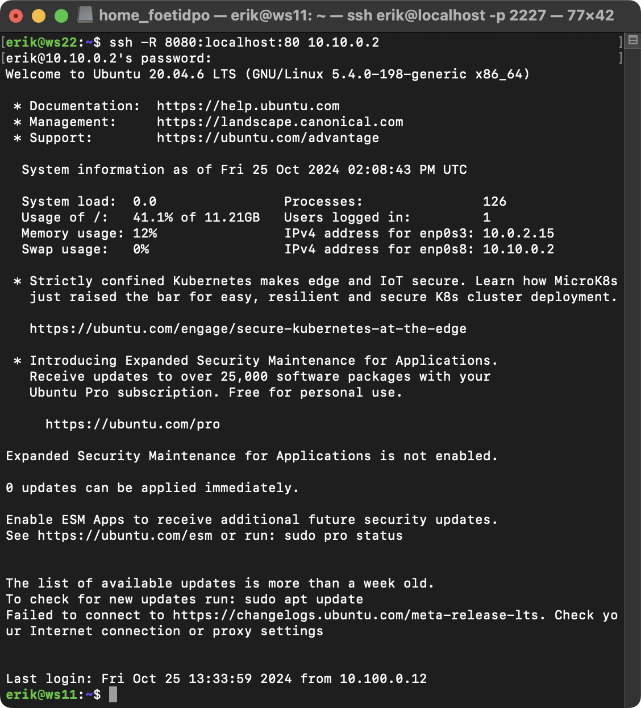 
    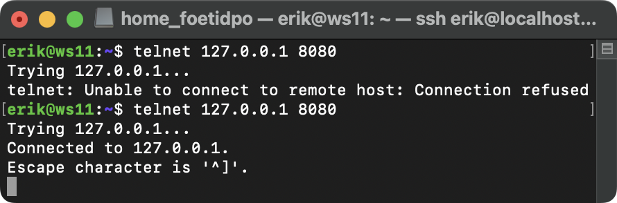 
 

- **Extra:**
    - *Remote TCP forwarding* allows to forward traffic from a port on a remote machine to a local machine over an SSH connection. It is used to allow access to services on a private network or behind firewalls from another machine by forwarding traffic from a port on a remote server to a local port

    - Unlike Local TCP Forwarding, Remote TCP Forwarding requires to set up the SSH connection in the opposite direction, from the host with the service back to the workstation

    - Command template: ssh -R [remote_host:]remote_port:local_host:local_port [user@]remote_server 

    - 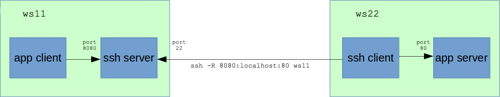   
